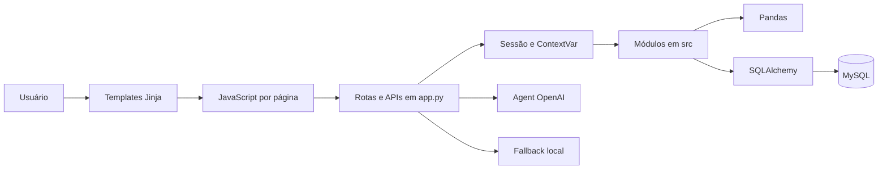

# Personal Finance Flow

Aplicação web de finanças pessoais com autenticação, dados isolados por usuário, importação de transações por CSV, dashboard, CRUDs financeiros, relatórios, preferências individuais e assistente com OpenAI e fallback local.

## Objetivo

O Personal Finance Flow reúne o fluxo de registro, importação, organização e consulta de finanças pessoais em uma aplicação Flask. Os dados são persistidos em MySQL, processados com Pandas e apresentados em páginas renderizadas com Jinja e JavaScript.

O sistema trabalha com valores já informados pelo usuário. A preferência de moeda altera a formatação, mas não realiza conversão monetária.

## Funcionalidades implementadas

- cadastro, login e logout;
- sessão Flask e proteção de páginas e APIs internas;
- isolamento de transações, categorias, metas, investimentos, relatórios e configurações por `usuario_id`;
- dashboard com entradas, saídas, investimentos, saldo, quantidade de transações, gráficos e insights;
- criação, consulta, edição, exclusão e filtros de transações;
- importação de CSV com transformação, categorização e deduplicação;
- categorias personalizadas, palavras-chave, cores e estatísticas;
- meta financeira ativa com progresso e valor restante;
- carteira de investimentos com filtros e resumo agregado;
- relatórios por intervalo de datas;
- assistente financeiro com OpenAI function calling e fallback local baseado em regras;
- preferências individuais de nome, tema, moeda, data, transações recentes, confirmação de exclusão e cards visíveis;
- restauração das preferências padrão;
- skill documentada para análise e importação de CSV financeiro;
- vault técnico em formato Obsidian;
- servidor MCP local e somente leitura para consultas financeiras e documentação controlada.

## Tecnologias

| Área | Implementação atual |
|---|---|
| Backend | Python e Flask 3.1.3 |
| Templates | Jinja2 |
| Frontend | HTML, CSS e JavaScript sem framework |
| Gráficos | Chart.js carregado no dashboard |
| Processamento | Pandas 2.3.3 e NumPy |
| Banco | MySQL com PyMySQL |
| Acesso a dados | SQLAlchemy Core, SQL textual parametrizado e Pandas `read_sql`/`to_sql` |
| Autenticação | Sessão Flask e hashes PBKDF2-SHA256 do Werkzeug |
| IA | OpenAI Python SDK com Chat Completions e function calling |
| Configuração | Variáveis de ambiente e `python-dotenv` |
| MCP | SDK MCP Python, FastMCP e transporte local `stdio` |

As versões completas estão em `requirements.txt` e, para o ambiente MCP separado, em `requirements-mcp.txt`.

## Arquitetura

A aplicação é um monólito Flask com camadas informais:



- `app.py` configura o Flask, páginas, APIs, sessão, validações HTTP e orquestração.
- `src/` contém autenticação, domínio financeiro, SQL, métricas, ETL e agentes.
- `templates/` e `static/` implementam a interface multipágina.
- `database/schema.sql` define as seis tabelas atuais.
- `before_request` coloca o usuário da sessão em um `ContextVar`; o teardown limpa esse contexto.
- as rotas passam `usuario_id` às operações de domínio.

Ao iniciar, `app.py` executa `garantir_colunas_usuario()`. Em bancos antigos, essa função pode adicionar `usuario_id` a metas, categorias e investimentos. O módulo de configurações também possui `CREATE TABLE IF NOT EXISTS`. Em uma instalação nova criada pelo schema atual, essas estruturas já existem.

Mais detalhes: [arquitetura do vault](brain/02-arquitetura.md) e [modelo de dados](brain/03-modelo-de-dados.md).

## Pipeline ETL

O pipeline web implementado é acionado por `POST /api/upload`:

1. valida presença do arquivo, nome e extensão `.csv`;
2. salva o upload em `uploads/`;
3. lê o CSV com Pandas;
4. remove duplicatas completas e normaliza colunas, datas, valores, tipos e status;
5. preenche e categoriza registros usando palavras-chave do usuário;
6. associa todas as linhas ao `usuario_id` da sessão;
7. compara o lote com as transações existentes do mesmo usuário;
8. grava somente registros novos em `transacoes`;
9. retorna quantidades recebidas, importadas, ignoradas e categorizadas automaticamente.

Cabeçalho esperado:

```text
data, descricao, categoria, tipo, valor, conta, instituicao, status
```

A deduplicação considera a combinação lógica de usuário, data, descrição, categoria, tipo, valor, conta, instituição e status. Essa regra está no código; não existe índice único equivalente no schema.

### Limitação do pipeline standalone

`src/main.py` não está alinhado com os contratos atuais: trata o retorno `(DataFrame, contador)` de `tratar_transacoes()` como um único DataFrame e chama a carga sem o `usuario_id` obrigatório. Use o upload web ou os módulos diretamente com o contexto e os argumentos corretos. Não considere `python src/main.py` um caminho funcional no estado atual.

Detalhes: [pipeline ETL](brain/04-pipeline-etl.md).

## CRUDs e consultas

| Área | Operações implementadas | Escopo |
|---|---|---|
| Usuários | cadastro e consulta para autenticação | e-mail único; não há edição ou exclusão de conta |
| Transações | listar, filtrar, criar, editar, excluir, importar e limpar | dados do usuário autenticado |
| Categorias | listar, criar, editar e excluir | categorias do usuário; `outros` não pode ser excluída |
| Metas | consultar ativa, criar, editar e excluir | meta mais recente com status `ativa` |
| Investimentos | listar, filtrar, consultar por ID, criar, editar, excluir e resumir | carteira do usuário |
| Configurações | consultar, atualizar parcialmente e restaurar padrões | uma configuração por usuário |
| Relatórios | consultar por período | somente leitura |

As métricas do dashboard consideram transações `confirmado` e calculam:

```text
saldo = entradas - saídas - transações do tipo investimento
```

Os relatórios possuem semântica diferente no código atual: calculam `entradas - saídas`, retornam investimentos separadamente e não aplicam o mesmo filtro global de status.

## Agent financeiro

A rota protegida `POST /api/assistente` recebe uma pergunta com até 500 caracteres.

### OpenAI

`src/ai_financial_agent.py` usa `client.chat.completions.create()` com modelo configurável. O agente publica onze ferramentas predefinidas para consultar saldo, entradas, saídas, categorias, meta, quantidade e transações recentes. O nome da ferramenta é validado contra um mapa interno; o modelo não recebe SQL nem acesso direto a arquivos.

O prompt determina que números devem vir das ferramentas, proíbe valores inventados e aconselhamento financeiro personalizado e usa moeda e formato de data das preferências do usuário.

### Fallback local

Quando o fluxo OpenAI lança uma exceção, a rota chama `src/financial_agent.py`. Esse agente não usa LLM: normaliza a pergunta, reconhece intenções e produz respostas por regras Python. Ele também possui consultas detalhadas da carteira de investimentos que não fazem parte das tools atuais do agente OpenAI.

Sem `OPENAI_API_KEY` disponível durante a inicialização, a aplicação continua com o fallback local.

Detalhes e contratos: [docs/assistente-financeiro.md](docs/assistente-financeiro.md).

## Skill `financial-csv-analyzer`

A skill em `skills/financial-csv-analyzer/SKILL.md` orienta agentes a analisar, validar, transformar, categorizar e, quando autorizado, importar CSVs usando o pipeline existente.

Ela não duplica o ETL nem adiciona um novo executável. A skill:

- referencia `extract.py`, `transform.py`, `categorization.py` e `load.py` como fontes de verdade;
- separa análise sem carga de importação;
- exige usuário válido para persistência;
- documenta colunas, validações, deduplicação, erros e saídas;
- evita o ponto de entrada standalone enquanto seu contrato permanecer incompatível.

## Brain

`brain/` é um vault técnico compatível com Obsidian:

| Arquivo | Conteúdo |
|---|---|
| `00-visao-geral.md` | escopo e capacidades |
| `01-requisitos.md` | requisitos derivados do código |
| `02-arquitetura.md` | camadas, rotas e fluxos |
| `03-modelo-de-dados.md` | tabelas e integridade |
| `04-pipeline-etl.md` | extração, transformação e carga |
| `05-decisoes-tecnicas.md` | decisões observadas na implementação |
| `06-erros-e-aprendizados.md` | inconsistências e limitações confirmadas |
| `07-prompts.md` | prompt persistido do assistente e function calling |

## MCP somente leitura

O servidor `personal-finance-flow-readonly` fica em `mcp/` e utiliza transporte local `stdio`.

Tools publicadas:

- `get_financial_summary`;
- `get_recent_transactions`;
- `get_spending_by_category`;
- `get_active_goal`;
- `get_investment_summary`;
- `list_categories`.

Também existem cinco resources fixos para visão geral, arquitetura, modelo de dados, ETL e schema. Não há tool para escrita, SQL arbitrário, caminho de arquivo ou troca de `usuario_id`.

O MCP requer Python 3.10 ou superior em ambiente separado, uma conta MySQL dedicada com apenas `SELECT` e um `.env.mcp` local. A implementação e o handshake do protocolo foram testados sem acessar o banco real; a integração com dados reais depende da configuração local dessa conta.

Instalação, permissões e configuração do Windsurf: [mcp/README.md](mcp/README.md).

## Autenticação e isolamento

- cadastro valida nome, e-mail, senha e confirmação;
- senhas são persistidas como hash PBKDF2-SHA256;
- login grava `usuario_id`, nome e e-mail na sessão;
- logout remove essas chaves;
- páginas protegidas redirecionam ao login;
- APIs protegidas retornam HTTP 401;
- consultas principais filtram por `usuario_id` da sessão ou do contexto da requisição.

O schema atual não define chaves estrangeiras. Além disso, `usuario_id` é anulável em metas, categorias e investimentos, e `categorias.nome` possui unicidade global. Portanto, o isolamento efetivo depende também das consultas da aplicação.

## Instalação da aplicação

### Pré-requisitos

- Python compatível com as versões fixadas em `requirements.txt`;
- MySQL em execução;
- cliente MySQL para aplicar o schema.

Na raiz do projeto:

```bash
python3 -m venv .venv
source .venv/bin/activate
python -m pip install --upgrade pip
python -m pip install -r requirements.txt
```

No Windows, a ativação normalmente é:

```powershell
.venv\Scripts\activate
```

## Configuração do `.env`

Crie o arquivo local:

```bash
cp .env.example .env
```

Variáveis presentes no exemplo:

```dotenv
DB_HOST=localhost
DB_PORT=3306
DB_USER=root
DB_PASSWORD=sua_senha_aqui
DB_NAME=personal_finance_flow
OPENAI_API_KEY=chave_openai_aqui
OPENAI_MODEL=gpt-4o-mini
```

Configurações adicionais da aplicação:

```dotenv
SECRET_KEY=substitua-por-um-segredo-aleatorio
```

`SECRET_KEY` ainda não aparece em `.env.example`. Se não estiver definida no ambiente do processo, `app.py` usa um fallback conhecido de desenvolvimento, inadequado para implantação.

`DB_*` é carregado por `python-dotenv` quando a conexão é criada. Já `SECRET_KEY`, `OPENAI_API_KEY` e `OPENAI_MODEL` são lidos durante a importação dos módulos. Para garantir que todos estejam disponíveis desde o início, exporte o `.env` antes de executar:

```bash
set -a
source .env
set +a
python app.py
```

Se a OpenAI não for configurada, o assistente local permanece disponível.

Não versione `.env`, `.env.mcp` ou credenciais reais.

## Criação do banco

Crie o banco e aplique o schema:

```bash
mysql -u root -p -e "CREATE DATABASE IF NOT EXISTS personal_finance_flow CHARACTER SET utf8mb4 COLLATE utf8mb4_unicode_ci;"
mysql -u root -p personal_finance_flow < database/schema.sql
```

O schema cria:

- `usuarios`;
- `transacoes`;
- `metas`;
- `categorias`;
- `investimentos`;
- `configuracoes_usuario`.

O usuário configurado em `DB_USER` precisa conseguir consultar e alterar dados dessas tabelas. Em bancos legados sem as colunas de proprietário, a inicialização também precisa de permissão para executar os `ALTER TABLE` previstos em `garantir_colunas_usuario()`.

## Execução

Com o ambiente virtual ativo, banco criado e variáveis disponíveis:

```bash
python app.py
```

A aplicação inicia com `debug=True` em:

```text
http://127.0.0.1:5001
```

Páginas públicas:

- `/`;
- `/login`;
- `/cadastro`.

Após autenticação:

- `/dashboard`;
- `/transacoes`;
- `/categorias`;
- `/metas`;
- `/investimentos`;
- `/relatorios`;
- `/assistente`;
- `/configuracoes`.

O servidor de desenvolvimento do Flask não é uma configuração de produção.

## Estrutura de pastas

```text
personal-finance-flow/
├── app.py                         # aplicação Flask e rotas
├── requirements.txt               # dependências da aplicação
├── requirements-mcp.txt           # dependências do MCP
├── .env.example                   # exemplo de ambiente da aplicação
├── .env.mcp.example               # exemplo de ambiente do MCP
├── brain/                         # vault técnico Obsidian
├── data/
│   ├── raw/                       # CSV bruto de exemplo
│   └── processed/                 # CSV tratado de exemplo
├── database/
│   └── schema.sql                 # schema MySQL
├── docs/                          # arquitetura, Agent e vibe coding
├── mcp/                           # servidor MCP somente leitura
├── presentation/                  # roteiro de apresentação
├── skills/
│   └── financial-csv-analyzer/    # skill do pipeline CSV
├── src/                           # domínio, dados, ETL, métricas e agentes
├── static/
│   ├── css/                       # estilos por página
│   ├── images/                    # imagens do projeto
│   └── js/                        # comportamento das páginas
├── templates/                     # templates Jinja
├── tests/                         # testes automatizados atuais do MCP
└── uploads/                       # CSVs recebidos pela aplicação
```

## Testes

A suíte versionada atual cobre somente o MCP somente leitura:

```bash
.venv/bin/python -m unittest discover -s tests -p 'test_mcp_readonly.py' -v
```

Os 11 testes atuais verificam consultas `SELECT`, escopo por usuário, impossibilidade de substituir a identidade fixa, limites, fórmulas, tools publicadas e allowlist de resources.

Para validar o servidor com o SDK MCP, instale primeiro o ambiente separado descrito em [mcp/README.md](mcp/README.md). O repositório não possui, neste momento, testes automatizados do Flask, CRUDs, autenticação, ETL ou interface.

## Próximos passos baseados nas lacunas atuais

Os itens abaixo são melhorias ainda não implementadas ou não confirmadas como concluídas:

- corrigir o contrato de `src/main.py` ou removê-lo como ponto de entrada;
- adicionar testes automatizados para autenticação, isolamento multiusuário, CRUDs, métricas e ETL;
- criar testes de interface e integração com MySQL;
- substituir a unicidade global de categoria por uma regra coerente com usuário e nome;
- adicionar chaves estrangeiras e revisar a nulabilidade de `usuario_id`;
- mover ajustes de schema da inicialização para migrações explícitas;
- centralizar as duas fábricas de conexão existentes;
- retirar o fallback conhecido de `SECRET_KEY` e documentá-la no arquivo de exemplo;
- definir normalização de nome e retenção/remoção dos uploads;
- tornar atômica a recategorização realizada durante a exclusão de categoria;
- alinhar e documentar a semântica financeira entre dashboard e relatórios;
- ampliar a cobertura de erros atualmente convertidos em resultados vazios;
- validar o MCP com uma conta MySQL real somente leitura e confirmar sua ativação no Windsurf.

## Documentação adicional

- [Visão geral](brain/00-visao-geral.md)
- [Requisitos](brain/01-requisitos.md)
- [Arquitetura](brain/02-arquitetura.md)
- [Modelo de dados](brain/03-modelo-de-dados.md)
- [Pipeline ETL](brain/04-pipeline-etl.md)
- [Erros e aprendizados](brain/06-erros-e-aprendizados.md)
- [Assistente financeiro](docs/assistente-financeiro.md)
- [Vibe coding](docs/vibe-coding.md)
- [MCP somente leitura](mcp/README.md)
