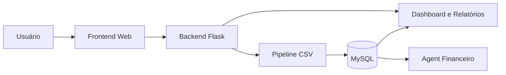

# Personal Finance Flow

Aplicação web de finanças pessoais com autenticação, isolamento de dados por usuário, importação de transações por CSV, dashboard, CRUDs financeiros, relatórios, preferências individuais e assistente financeiro com OpenAI e fallback local.

## Objetivo

O **Personal Finance Flow** centraliza o registro, a importação, a organização e a consulta de finanças pessoais em uma aplicação web Flask.

O sistema permite:

- importar transações financeiras por CSV;
- organizar entradas, saídas, gastos e investimentos;
- acompanhar indicadores por meio de uma dashboard;
- gerenciar transações, categorias, metas e investimentos;
- consultar informações financeiras em linguagem natural;
- manter dados separados por usuário autenticado.

Os dados são persistidos em MySQL, processados com Pandas e apresentados em páginas renderizadas com Jinja, CSS e JavaScript.

> A preferência de moeda altera apenas a formatação dos valores. O sistema não realiza conversão monetária.

---

## Funcionalidades implementadas

- cadastro, login e logout;
- autenticação por sessão Flask;
- proteção de páginas e APIs internas;
- isolamento por `usuario_id`;
- dashboard com entradas, saídas, investimentos, saldo, gráficos e insights;
- CRUD de transações;
- CRUD de categorias;
- CRUD de metas financeiras;
- CRUD de investimentos;
- filtros e consultas financeiras;
- importação de transações por CSV;
- validação, transformação, categorização e deduplicação;
- sincronização entre transações e investimentos;
- relatórios por intervalo de datas;
- exportação por meio do diálogo de impressão do navegador;
- assistente financeiro com OpenAI;
- fallback local baseado em regras;
- configurações individuais por usuário;
- restauração das preferências padrão;
- Skill para análise de CSV financeiro;
- Brain técnico compatível com Obsidian;
- servidor MCP local e somente leitura;
- testes unitários, de integração e de segurança;
- scripts de execução dos testes com relatórios timestampados.

---

## Tecnologias

| Área | Implementação |
|---|---|
| Backend | Python e Flask |
| Templates | Jinja2 |
| Frontend | HTML, CSS e JavaScript |
| Gráficos | Chart.js |
| Processamento de dados | Pandas e NumPy |
| Banco de dados | MySQL |
| Acesso a dados | SQLAlchemy Core, SQL parametrizado e Pandas |
| Autenticação | Sessão Flask e hashes do Werkzeug |
| Inteligência artificial | OpenAI Python SDK |
| Configuração | Variáveis de ambiente e `python-dotenv` |
| MCP | SDK MCP Python, FastMCP e transporte `stdio` |
| Testes | `unittest` e mocks Python |
| IDE utilizada | Windsurf |
| Desenvolvimento assistido | Vibe Coding |

As dependências completas estão em:

- `requirements.txt`;
- `requirements-mcp.txt`.

---

## Visão geral da solução



Fluxo principal:

```text
CSV
 ↓
Extração
 ↓
Transformação e categorização
 ↓
Deduplicação
 ↓
MySQL
 ↓
Dashboard, CRUDs, relatórios e Agent
```

---

## Arquitetura

O projeto é uma aplicação Flask organizada por responsabilidades.

### Frontend

```text
a_frontend_webclient/
```

Contém:

- templates Jinja;
- arquivos CSS;
- arquivos JavaScript;
- imagens e recursos visuais.

### Backend

```text
b_backend/
```

Contém:

- inicialização da aplicação Flask;
- autenticação;
- APIs;
- CRUDs;
- métricas;
- relatórios;
- configurações;
- Agent OpenAI;
- fallback local.

### Pipeline financeiro

```text
c_generate_rpa/
```

Contém:

- extração de CSV;
- transformação;
- categorização;
- persistência;
- dados de exemplo.

### Rastreabilidade

```text
d_traceability/
```

Contém:

- documentação;
- Brain;
- Skill;
- MCP;
- decisões arquiteturais;
- requisitos;
- prompts;
- registros técnicos.

### Verificação

```text
e_verify/
```

Contém os testes automatizados organizados em:

- unitários;
- integração;
- segurança;
- fixtures.

### Execução dos testes

```text
f_test_execution/
```

Contém:

- executor geral;
- scripts por tipo de teste;
- plano de testes manuais;
- relatórios timestampados.

### Saídas

```text
g_output/
```

É destinada a:

- relatórios;
- exportações;
- capturas de tela;
- resultados finais de testes.

---

## Componentes principais

- `b_backend/a_app.py`: inicialização Flask, páginas, APIs e orquestração;
- `b_backend/b_src/`: domínio financeiro, autenticação, métricas, relatórios e Agents;
- `c_generate_rpa/`: pipeline de importação de CSV;
- `a_frontend_webclient/b_templates/`: páginas Jinja;
- `a_frontend_webclient/a_static/`: CSS, JavaScript e imagens;
- `h_database/a_schema.sql`: estrutura do banco;
- `d_traceability/a_brain/`: memória técnica do projeto;
- `d_traceability/d_skills/`: Skill de análise financeira;
- `d_traceability/c_mcp/`: servidor MCP;
- `e_verify/`: testes automatizados;
- `f_test_execution/`: scripts e relatórios de teste.

O Flask é configurado para localizar os diretórios de templates e arquivos estáticos dentro de `a_frontend_webclient`, independentemente do diretório atual do terminal.

Mais detalhes:

- [Arquitetura técnica](d_traceability/a_brain/c_arquitetura.md)
- [Modelo de dados](d_traceability/a_brain/d_modelo_de_dados.md)
- [Pipeline ETL](d_traceability/a_brain/e_pipeline_etl.md)

---

## Pipeline financeiro por CSV

O pipeline é acionado pela rota:

```text
POST /api/upload
```

Etapas:

1. valida a presença do arquivo;
2. valida o nome e a extensão `.csv`;
3. salva temporariamente o arquivo recebido;
4. lê os dados com Pandas;
5. normaliza colunas, datas, tipos, valores e status;
6. remove duplicidades dentro do próprio arquivo;
7. categoriza os registros;
8. associa as linhas ao `usuario_id` autenticado;
9. compara o lote com os registros já existentes;
10. grava somente as novas transações;
11. cria investimentos vinculados quando necessário;
12. retorna o resumo da importação.

### Cabeçalho esperado

```text
data,descricao,categoria,tipo,valor,conta,instituicao,status
```

### Exemplo

```csv
data,descricao,categoria,tipo,valor,conta,instituicao,status
2026-06-01,Salário,Salário,entrada,5000.00,Conta corrente,Banco A,confirmado
2026-06-02,Supermercado,Alimentação,saida,250.90,Cartão,Banco B,confirmado
2026-06-03,Aporte mensal,Investimentos,investimento,500.00,Corretora,Corretora A,confirmado
```

### Deduplicação

A deduplicação considera a combinação lógica de:

- usuário;
- data;
- descrição;
- categoria;
- tipo;
- valor;
- conta;
- instituição;
- status.

A regra é aplicada pelo código da aplicação. Não existe um índice único equivalente no schema.

Mais detalhes:

- [Pipeline técnico](d_traceability/a_brain/e_pipeline_etl.md)
- [Documentação do RPA](c_generate_rpa/README.md)

---

## Sincronização entre transações e investimentos

Transações com:

```text
tipo = investimento
status = confirmado
```

criam automaticamente um investimento vinculado por `transacao_id`.

Isso ocorre em:

- criação manual;
- importação por CSV.

### Edição

Ao editar uma transação:

- se ela se tornar um investimento confirmado, o investimento é criado;
- se já existir um investimento vinculado, ele é atualizado;
- se deixar de ser investimento ou confirmado, o vínculo é removido.

### Exclusão

Ao excluir uma transação, o investimento vinculado também é removido.

Investimentos criados diretamente na tela de investimentos não dependem de uma transação e possuem:

```text
transacao_id = NULL
```

---

## CRUDs e consultas

| Área | Operações |
|---|---|
| Usuários | cadastro e autenticação |
| Transações | listar, filtrar, criar, editar, excluir, importar e limpar |
| Categorias | listar, criar, editar e excluir |
| Metas | consultar, criar, editar e excluir |
| Investimentos | listar, filtrar, criar, editar, excluir e resumir |
| Configurações | consultar, atualizar e restaurar padrões |
| Relatórios | consultar por período e imprimir |
| Assistente | consultar dados financeiros em linguagem natural |

Todas as operações financeiras utilizam o usuário autenticado como escopo.

---

## Dashboard

A dashboard apresenta:

- total de entradas;
- total de saídas;
- total investido;
- saldo;
- quantidade de transações;
- transações recentes;
- distribuição por categoria;
- evolução financeira;
- insights automáticos.

O saldo da dashboard segue a regra:

```text
saldo = entradas - saídas - investimentos
```

As métricas consideram as transações com status confirmado.

---

## Relatórios

Os relatórios permitem consultar os dados por intervalo de datas.

São exibidos:

- entradas;
- saídas;
- investimentos;
- saldo do período;
- categorias;
- evolução;
- transações.

A exportação atual utiliza:

```javascript
window.print()
```

Portanto, o usuário pode imprimir ou salvar o relatório como PDF usando o navegador.

A geração nativa de arquivos PDF permanece como melhoria futura.

---

## Agent financeiro

O assistente está disponível por meio da rota protegida:

```text
POST /api/assistente
```

A pergunta enviada possui limite de 500 caracteres.

### Agent OpenAI

O arquivo:

```text
b_backend/b_src/j_ai_financial_agent.py
```

utiliza o SDK da OpenAI e ferramentas controladas para consultar os dados financeiros.

O modelo não recebe:

- acesso direto ao banco;
- SQL arbitrário;
- caminhos livres de arquivos;
- permissão de escrita.

Entre as consultas disponíveis estão:

- saldo;
- entradas;
- saídas;
- investimentos;
- quantidade de transações;
- transações recentes;
- gastos por categoria;
- maior categoria de gasto;
- meta ativa;
- progresso financeiro.

Perguntas sobre a maior categoria de gastos recebem prioridade e utilizam a ferramenta apropriada.

Exemplos:

```text
Qual é o meu saldo?
Quanto eu gastei este mês?
Onde eu mais gastei?
Qual é a minha maior categoria de gasto?
Como está minha meta?
Quais são minhas últimas transações?
```

### Fallback local

Caso a OpenAI não esteja configurada ou ocorra uma falha, o sistema utiliza:

```text
b_backend/b_src/i_financial_agent.py
```

O fallback:

- normaliza a pergunta;
- identifica intenções;
- consulta as métricas existentes;
- monta respostas por regras Python;
- não utiliza LLM.

A aplicação continua funcional sem `OPENAI_API_KEY`.

Mais detalhes:

- [Documentação do Agent](d_traceability/b_docs/a_general/b_agent.md)

---

## Hyper, Agent, Skill, Brain e MCP

### Hyper / Agent

No projeto, o conceito de **Hyper** é representado pelo Agent financeiro.

Ele interpreta perguntas em linguagem natural e utiliza funções controladas para buscar informações reais do usuário.

### Skill

A Skill está em:

```text
d_traceability/d_skills/a_financial_csv_analyzer/a_skill.md
```

Ela orienta agentes sobre como:

- analisar CSVs;
- validar colunas;
- transformar dados;
- categorizar transações;
- evitar duplicidades;
- importar registros quando autorizado.

A Skill reutiliza o pipeline existente e não duplica sua implementação.

### Brain

O Brain está em:

```text
d_traceability/a_brain/
```

Ele funciona como uma memória técnica compatível com Obsidian e reúne:

- visão geral;
- requisitos;
- arquitetura;
- banco de dados;
- pipeline;
- decisões;
- aprendizados;
- prompts.

### MCP

O servidor MCP está em:

```text
d_traceability/c_mcp/
```

Ele oferece consultas financeiras somente leitura para ferramentas externas compatíveis.

O MCP:

- utiliza transporte local `stdio`;
- possui ferramentas predefinidas;
- não aceita SQL arbitrário;
- não possui operações de escrita;
- utiliza usuário financeiro controlado;
- restringe os documentos acessíveis.

### Vibe Coding

O projeto foi desenvolvido com apoio de inteligência artificial na IDE Windsurf.

A IA foi utilizada para:

- análise;
- implementação;
- revisão;
- testes;
- organização;
- documentação;
- correção de inconsistências.

As decisões e validações permaneceram sob controle humano.

Mais detalhes:

- [Vibe Coding](d_traceability/b_docs/a_general/d_vibe_coding.md)

---

## Skill `financial-csv-analyzer`

A Skill referencia como fontes de verdade:

- `c_generate_rpa/a_extract.py`;
- `c_generate_rpa/b_transform.py`;
- `c_generate_rpa/c_categorization.py`;
- `c_generate_rpa/d_load.py`.

Ela:

- separa análise de persistência;
- exige usuário válido para importação;
- documenta o formato do CSV;
- define validações;
- explica a deduplicação;
- orienta o tratamento de erros;
- impede persistência sem autorização.

---

## Brain técnico

| Arquivo | Conteúdo |
|---|---|
| `00-visao-geral.md` | escopo e capacidades |
| `01-requisitos.md` | requisitos do projeto |
| `02-arquitetura.md` | camadas, módulos e fluxos |
| `03-modelo-de-dados.md` | tabelas e integridade |
| `04-pipeline-etl.md` | processamento de CSV |
| `05-decisoes-tecnicas.md` | decisões arquiteturais |
| `06-erros-e-aprendizados.md` | problemas e aprendizados |
| `07-prompts.md` | prompts e regras do assistente |

---

## MCP somente leitura

O servidor:

```text
personal-finance-flow-readonly
```

utiliza transporte local `stdio`.

### Tools disponíveis

- `get_financial_summary`;
- `get_recent_transactions`;
- `get_spending_by_category`;
- `get_active_goal`;
- `get_investment_summary`;
- `list_categories`.

### Proteções

- sem operações de escrita;
- sem SQL arbitrário;
- consultas controladas;
- limites de retorno;
- escopo por usuário;
- resources definidos por allowlist;
- banco recomendado com permissão apenas de `SELECT`.

O MCP requer:

- Python 3.10 ou superior;
- ambiente virtual separado;
- dependências de `requirements-mcp.txt`;
- conta MySQL somente leitura;
- arquivo `.env.mcp` local.

Mais detalhes:

- [Instalação e configuração do MCP](d_traceability/c_mcp/f_readme.md)

---

## Autenticação e isolamento

- cadastro valida nome, e-mail, senha e confirmação;
- senhas são armazenadas como hash;
- login salva o usuário na sessão;
- logout remove os dados da sessão;
- páginas protegidas redirecionam ao login;
- APIs protegidas retornam HTTP 401;
- consultas financeiras filtram pelo usuário autenticado.

O banco utiliza `usuario_id` nas tabelas financeiras.

A tabela de categorias utiliza unicidade composta:

```text
(usuario_id, nome)
```

Assim, usuários diferentes podem possuir categorias com o mesmo nome.

---

## Limpar todos os dados

A funcionalidade **Limpar todos os dados** remove do usuário autenticado:

- investimentos;
- transações;
- metas;
- categorias.

São preservados:

- usuário;
- e-mail;
- senha;
- sessão;
- configurações da conta.

---

## Instalação

### Pré-requisitos

- Python;
- MySQL;
- cliente MySQL;
- Git, caso o projeto seja clonado;
- chave OpenAI opcional.

### Criar o ambiente virtual

Na raiz do projeto:

```bash
python3 -m venv .venv
source .venv/bin/activate
```

No Windows:

```powershell
.venv\Scripts\activate
```

### Instalar as dependências

```bash
python -m pip install --upgrade pip
python -m pip install -r requirements.txt
```

---

## Configuração do ambiente

Crie o arquivo local:

```bash
cp .env.example .env
```

Exemplo:

```dotenv
DB_HOST=localhost
DB_PORT=3306
DB_USER=root
DB_PASSWORD=sua_senha
DB_NAME=personal_finance_flow

SECRET_KEY=substitua-por-um-segredo-seguro

OPENAI_API_KEY=
OPENAI_MODEL=gpt-4o-mini
```

### Variáveis

| Variável | Obrigatória | Finalidade |
|---|---:|---|
| `DB_HOST` | Sim | servidor MySQL |
| `DB_PORT` | Sim | porta do MySQL |
| `DB_USER` | Sim | usuário do banco |
| `DB_PASSWORD` | Sim | senha do banco |
| `DB_NAME` | Sim | nome do banco |
| `SECRET_KEY` | Sim | assinatura segura da sessão Flask |
| `OPENAI_API_KEY` | Não | habilita o Agent OpenAI |
| `OPENAI_MODEL` | Não | modelo utilizado pelo Agent |
| `FLASK_DEBUG` | Não | controla o modo debug |
| `APP_ENV` | Não | identifica o ambiente |

`SECRET_KEY` é obrigatória. A aplicação não deve ser iniciada sem essa variável.

Não versione:

- `.env`;
- `.env.mcp`;
- senhas;
- chaves reais;
- ambientes virtuais.

### Carregar as variáveis no terminal

Em macOS ou Linux:

```bash
set -a
source .env
set +a
```

---

## Criação do banco

```bash
mysql -u root -p -e \
"CREATE DATABASE IF NOT EXISTS personal_finance_flow
 CHARACTER SET utf8mb4
 COLLATE utf8mb4_unicode_ci;"
```

Aplicar o schema:

```bash
mysql -u root -p personal_finance_flow < h_database/a_schema.sql
```

Tabelas:

- `usuarios`;
- `transacoes`;
- `metas`;
- `categorias`;
- `investimentos`;
- `configuracoes_usuario`.

O usuário definido em `DB_USER` precisa possuir as permissões necessárias para a aplicação.

---

## Execução

A execução oficial deve ser feita a partir da raiz do projeto.

```bash
source .venv/bin/activate
set -a
source .env
set +a
python -m b_backend.a_app
```

A aplicação fica disponível em:

```text
http://127.0.0.1:5001
```

### Páginas públicas

- `/`;
- `/login`;
- `/cadastro`.

### Páginas autenticadas

- `/dashboard`;
- `/transacoes`;
- `/categorias`;
- `/metas`;
- `/investimentos`;
- `/relatorios`;
- `/assistente`;
- `/configuracoes`.

> Evite entrar na pasta `b_backend` e executar o arquivo diretamente. O comando oficial é `python -m b_backend.a_app`, executado a partir da raiz.

O servidor Flask utilizado é destinado ao desenvolvimento local.

---

## Estrutura de pastas

```text
personal-finance-flow/
├── README.md
├── requirements.txt
├── requirements-mcp.txt
├── .env.example
├── .gitignore
│
├── a_frontend_webclient/
│   ├── a_static/
│   │   ├── a_css/
│   │   ├── b_js/
│   │   └── c_images/
│   └── b_templates/
│
├── b_backend/
│   ├── a_app.py
│   └── b_src/
│       ├── __init__.py
│       ├── a_auth.py
│       ├── b_usuario_contexto.py
│       ├── c_transacoes.py
│       └── ...
│
├── c_generate_rpa/
│   ├── a_extract.py
│   ├── b_transform.py
│   ├── c_categorization.py
│   ├── d_load.py
│   └── e_samples/
│
├── d_traceability/
│   ├── __init__.py
│   ├── a_brain/
│   ├── b_docs/
│   │   ├── a_general/
│   │   ├── b_adr/
│   │   ├── c_product/
│   │   ├── d_prd/
│   │   ├── e_prompts/
│   │   └── f_screenshots/
│   ├── c_mcp/
│   └── d_skills/
│
├── e_verify/
│   ├── __init__.py
│   ├── a_unit/
│   ├── b_integration/
│   └── c_security/
│
├── f_test_execution/
│   ├── a_run_unit_tests.sh
│   ├── b_run_integration_tests.sh
│   ├── c_run_all_tests.py
│   ├── d_manual_test_plan.md
│   └── e_reports/
│
├── g_output/
│   ├── reports/
│   ├── exports/
│   ├── screenshots/
│   ├── test_results/
│   └── README.md
│
├── g_uploads/
│   └── .gitkeep
│
└── h_database/
    ├── a_schema.sql
    └── b_migrations/
```

---

## Testes

Os testes estão organizados em:

```text
e_verify/
├── unit/
├── integration/
├── security/
└── fixtures/
```

A suíte atual cobre:

- categorização automática;
- categorias padrão;
- importação por CSV;
- deduplicação;
- API de upload;
- MCP somente leitura;
- escopo por usuário;
- allowlist de resources;
- limites de consulta;
- fórmulas financeiras;
- tools publicadas.

### Executar todos os testes

```bash
python f_test_execution/c_run_all_tests.py
```

O executor:

- localiza as suítes;
- executa os testes;
- contabiliza sucessos, falhas e erros;
- retorna código diferente de zero quando há falha;
- cria relatório timestampado em:

```text
f_test_execution/e_reports/
```

Exemplo:

```text
test_report_2026-07-01_051055.txt
```

### Executar somente testes unitários

```bash
bash f_test_execution/a_run_unit_tests.sh
```

### Executar testes de integração

```bash
bash f_test_execution/b_run_integration_tests.sh
```

Na última validação da reorganização estrutural:

```text
Testes encontrados: 25
Sucessos: 25
Falhas: 0
Erros: 0
```

Também foram validados:

- compilação dos módulos;
- carregamento dos templates;
- carregamento dos arquivos estáticos;
- rotas públicas;
- proteção das rotas autenticadas.

---

## Saídas com timestamp

Arquivos gerados para entrega ou evidência devem seguir:

```text
nome_YYYY-MM-DD_HHMMSS.ext
```

Exemplos:

```text
relatorio_financeiro_2026-07-01_143022.pdf
resultado_testes_2026-07-01_143144.txt
dashboard_2026-07-01_143230.png
transacoes_2026-07-01_143415.csv
```

Pastas destinadas às saídas:

```text
g_output/
├── reports/
├── exports/
├── screenshots/
└── test_results/
```

O banco MySQL e os templates da dashboard não ficam em `g_output`.

---

## Limitações atuais

- a importação aceita apenas CSV;
- não existe conversão monetária;
- a exportação de relatório utiliza o navegador;
- o Agent local utiliza regras, não um modelo de linguagem;
- a integração OpenAI depende de chave e acesso à API;
- o MCP depende de configuração local;
- o servidor Flask é destinado ao desenvolvimento;
- não existe migração versionada do banco;
- não há geração nativa de PDF;
- a cobertura automatizada ainda não contempla toda a interface.

---

## Próximos passos

- ampliar os testes de autenticação e CRUDs;
- criar testes com banco MySQL isolado;
- adicionar testes de interface;
- gerar PDF de forma nativa;
- criar migrações de banco versionadas;
- ampliar a observabilidade;
- validar o MCP com conta MySQL real somente leitura;
- alinhar completamente as regras financeiras entre dashboard e relatórios;
- revisar retenção e remoção de uploads;
- preparar configuração para produção.

---

## Documentação adicional

- [Índice da documentação](d_traceability/b_docs/a_general/a_readme.md)
- [Visão geral](d_traceability/a_brain/a_visao_geral.md)
- [Requisitos](d_traceability/a_brain/b_requisitos.md)
- [Arquitetura](d_traceability/a_brain/c_arquitetura.md)
- [Modelo de dados](d_traceability/a_brain/d_modelo_de_dados.md)
- [Pipeline ETL](d_traceability/a_brain/e_pipeline_etl.md)
- [Decisões técnicas](d_traceability/a_brain/f_decisoes_tecnicas.md)
- [Erros e aprendizados](d_traceability/a_brain/g_erros_e_aprendizados.md)
- [Prompts](d_traceability/a_brain/h_prompts.md)
- [Agent financeiro](d_traceability/b_docs/a_general/b_agent.md)
- [Vibe Coding](d_traceability/b_docs/a_general/d_vibe_coding.md)
- [Skill](d_traceability/d_skills/a_financial_csv_analyzer/a_skill.md)
- [MCP somente leitura](d_traceability/c_mcp/f_readme.md)
- [Plano de testes manuais](f_test_execution/d_manual_test_plan.md)

---

## Segurança

- não envie `.env` ao repositório;
- não exponha `SECRET_KEY`;
- não exponha `OPENAI_API_KEY`;
- utilize consultas parametrizadas;
- mantenha o MCP somente leitura;
- utilize um usuário MySQL restrito para o MCP;
- não utilize o servidor Flask de desenvolvimento em produção;
- revise permissões antes de publicar o projeto.

---

## Status

O projeto possui:

- pipeline financeiro funcional;
- CRUDs end-to-end;
- dashboard;
- relatórios;
- Agent;
- Skill;
- Brain;
- MCP;
- testes automatizados;
- documentação;
- estrutura organizada por responsabilidade.

A aplicação foi validada após a reorganização estrutural com compilação, testes, templates, arquivos estáticos e rotas Flask.
