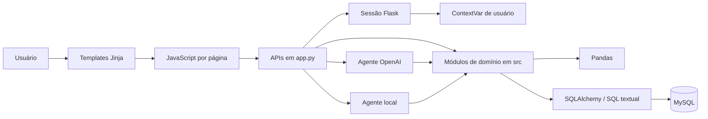
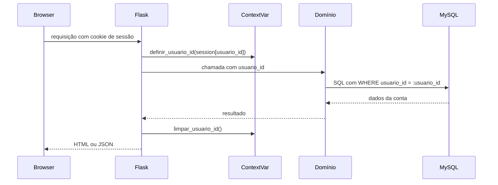
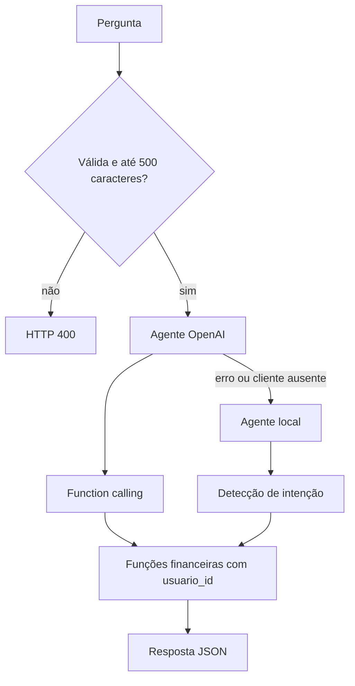

# Arquitetura

## Estilo geral

A aplicação é um monólito Flask organizado em camadas informais. `app.py` concentra composição, rotas, autenticação e tradução HTTP; os módulos em `src/` concentram domínio, consultas SQL, ETL, métricas e assistentes. O frontend é multipágina, renderizado no servidor, e usa JavaScript para consumir APIs JSON.

## Camada web — `app.py`

Responsabilidades confirmadas:

- Configurar Flask, JSON e chave de sessão.
- Executar `garantir_colunas_usuario()` durante a importação da aplicação.
- Registrar e limpar o usuário atual no `ContextVar` por requisição.
- Proteger rotas com `login_obrigatorio`.
- Renderizar páginas Jinja.
- Validar corpos JSON, arquivos e parâmetros de consulta.
- Delegar operações aos módulos em `src/`.
- Traduzir resultados e exceções em respostas HTTP.

### Páginas

| Pública | Protegida |
|---|---|
| `/` | `/dashboard` |
| `/login` | `/transacoes` |
| `/cadastro` | `/categorias` |
|  | `/relatorios` |
|  | `/metas` |
|  | `/investimentos` |
|  | `/assistente` |
|  | `/configuracoes` |

### Grupos de API

- Autenticação: `/api/cadastro`, `/api/login`, `/api/logout`.
- Dashboard: `/api/metricas` e `/api/transacoes`.
- Transações: `/api/transacoes`, `/api/transacoes/todas`, `/api/transacoes/<id>`, `/api/transacoes/limpar`.
- ETL: `/api/upload`.
- Metas: `/api/meta` e `/api/meta/<id>`.
- Categorias: `/api/categorias` e `/api/categorias/<nome>`.
- Assistente: `/api/assistente`.
- Relatórios: `/api/relatorios`.
- Investimentos: `/api/investimentos`, `/api/investimentos/<id>` e `/api/investimentos/resumo`.
- Configurações: `/api/configuracoes` e `/api/configuracoes/restaurar`.

## Camada de domínio e dados — `src/`

| Módulo | Papel |
|---|---|
| `auth.py` | Usuários, hashes e consulta de credenciais |
| `usuario_contexto.py` | `ContextVar` para propagar o usuário ativo |
| `transacoes.py` | Consulta e CRUD de transações |
| `categorias.py` | CRUD, regras e estatísticas de categorias |
| `metas.py` | Consulta e CRUD de metas |
| `investimentos.py` | Validação, CRUD e resumo de investimentos |
| `relatorios.py` | Agregações por período |
| `metrics.py` | Métricas, insights e transações recentes |
| `configuracoes.py` | Defaults e persistência das preferências |
| `extract.py` | Leitura de CSV |
| `transform.py` | Limpeza, padronização e categorização |
| `categorization.py` | Regras de palavras-chave |
| `load.py` | Engine, compatibilidade de schema, carga e limpeza |
| `financial_agent.py` | Assistente determinístico baseado em intenções |
| `ai_financial_agent.py` | Assistente OpenAI com function calling |
| `utils.py` | Formatação de moeda e data por preferência |
| `database.py` | Segunda fábrica de engine e sessão SQLAlchemy |
| `main.py` | Entrada standalone do pipeline legado |

## Persistência

O projeto usa SQLAlchemy sem modelos ORM declarativos. As operações são feitas com:

- `sqlalchemy.text()` e parâmetros nomeados;
- conexões explícitas e `commit()` em operações de escrita;
- `pandas.read_sql()` para consultas tabulares;
- `DataFrame.to_sql()` na carga em lote.

Cada chamada de `obter_engine()` cria um novo engine com credenciais obtidas do `.env`. Existe também `get_connection()` em `src/database.py`, com construção equivalente.

## Isolamento por usuário

As rotas normalmente passam o identificador explicitamente. Métricas, metas e categorias também conseguem resolvê-lo pelo contexto. Os limites estruturais desse isolamento estão em [[06-erros-e-aprendizados]].

## Frontend

- Cada domínio possui um template e, em geral, um CSS e JavaScript correspondentes.
- Os scripts usam `fetch()` para consumir as APIs.
- `_preferencias_usuario.html` serializa as configurações para `window.PFF_CONFIG`.
- `static/js/temas.js` expõe `window.PFF` para tema, moeda, data, confirmação de exclusão, cards e salvamento parcial de preferências.
- O dashboard usa Chart.js para os gráficos.

## Arquitetura do assistente

O agente OpenAI usa até quatro iterações e `tool_choice="auto"`. O agente local não usa modelo; ele normaliza texto, identifica intenções e monta respostas a partir dos mesmos módulos financeiros.

## Configuração e execução

Variáveis documentadas em `.env.example`:

- `DB_HOST`, `DB_PORT`, `DB_USER`, `DB_PASSWORD`, `DB_NAME`;
- `OPENAI_API_KEY`, `OPENAI_MODEL`.

`SECRET_KEY` é lida por `app.py`, embora não apareça no `.env.example`. Ao executar diretamente, o servidor usa host `127.0.0.1`, porta `5001` e modo debug.

## Notas relacionadas

- [[03-modelo-de-dados]]
- [[04-pipeline-etl]]
- [[05-decisoes-tecnicas]]
- [[07-prompts]]
