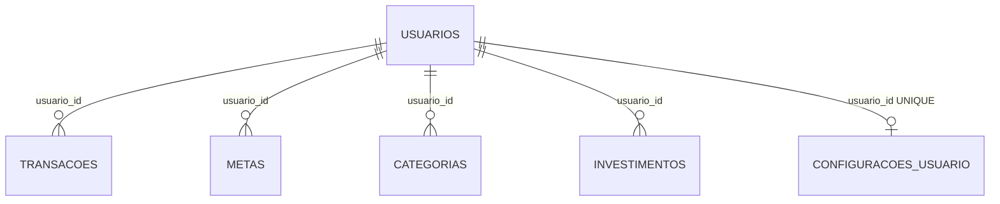

# Modelo de dados

## Visão lógica

O schema usa MySQL e define seis tabelas. As relações abaixo são lógicas, inferidas pelo uso de `usuario_id`; o arquivo `database/schema.sql` não declara chaves estrangeiras.



## `usuarios`

| Coluna | Tipo | Regra |
|---|---|---|
| `id` | `INT` | PK, auto incremento |
| `nome` | `VARCHAR(255)` | obrigatório |
| `email` | `VARCHAR(255)` | obrigatório e único |
| `telefone` | `VARCHAR(20)` | opcional |
| `senha_hash` | `VARCHAR(255)` | obrigatório |
| `criado_em` | `TIMESTAMP` | padrão atual |

O cadastro gera `senha_hash` com Werkzeug PBKDF2-SHA256. A autenticação consulta o usuário pelo e-mail.

## `transacoes`

| Coluna | Tipo | Regra |
|---|---|---|
| `id` | `INT` | PK, auto incremento |
| `usuario_id` | `INT` | obrigatório |
| `data_transacao` | `DATE` | obrigatório |
| `descricao` | `VARCHAR(255)` | obrigatório |
| `categoria` | `VARCHAR(100)` | opcional |
| `tipo` | `ENUM` | `entrada`, `saida`, `investimento` |
| `valor` | `DECIMAL(10,2)` | obrigatório |
| `conta` | `VARCHAR(100)` | opcional |
| `instituicao` | `VARCHAR(100)` | opcional |
| `status` | `ENUM` | `confirmado`, `pendente`, `cancelado`; padrão `pendente` |
| `criado_em` | `TIMESTAMP` | padrão atual |

Somente transações `confirmado` participam das métricas de `src/metrics.py`. Relatórios consultam transações por usuário e intervalo, sem o mesmo filtro global obrigatório de status.

## `metas`

| Coluna | Tipo | Regra |
|---|---|---|
| `id` | `INT` | PK, auto incremento |
| `usuario_id` | `INT` | anulável no schema |
| `titulo` | `VARCHAR(255)` | obrigatório |
| `valor_meta` | `DECIMAL(10,2)` | obrigatório |
| `valor_atual` | `DECIMAL(10,2)` | padrão 0 |
| `data_limite` | `DATE` | opcional |
| `status` | `ENUM` | `ativa`, `concluida`, `cancelada`; padrão `ativa` |
| `criado_em` | `TIMESTAMP` | padrão atual |
| `atualizado_em` | `TIMESTAMP` | atualização automática |

O sistema busca somente a meta ativa mais recente: `ORDER BY id DESC LIMIT 1`. Percentual e valor restante são calculados pela API, não armazenados.

## `categorias`

| Coluna | Tipo | Regra |
|---|---|---|
| `id` | `INT` | PK, auto incremento |
| `usuario_id` | `INT` | anulável no schema |
| `nome` | `VARCHAR(100)` | obrigatório, `UNIQUE` global |
| `palavras_chave` | `TEXT` | JSON serializado |
| `cor` | `VARCHAR(20)` | opcional |
| `criado_em` | `TIMESTAMP` | padrão atual |
| `atualizado_em` | `TIMESTAMP` | atualização automática |

O código sempre consulta categorias por `usuario_id`, mas a unicidade declarada incide apenas sobre `nome`. Portanto, o schema não representa uma chave composta `(usuario_id, nome)`.

As estatísticas da categoria são agregadas dinamicamente sobre `transacoes`; não há relação física entre `transacoes.categoria` e `categorias.nome`.

## `investimentos`

| Coluna | Tipo | Regra |
|---|---|---|
| `id` | `INT` | PK, auto incremento |
| `usuario_id` | `INT` | anulável no schema |
| `nome` | `VARCHAR(150)` | obrigatório |
| `tipo` | `VARCHAR(80)` | obrigatório |
| `instituicao` | `VARCHAR(120)` | opcional |
| `valor_aplicado` | `DECIMAL(12,2)` | obrigatório |
| `valor_atual` | `DECIMAL(12,2)` | obrigatório |
| `rentabilidade_percentual` | `DECIMAL(8,2)` | padrão 0 |
| `data_aplicacao` | `DATE` | obrigatório |
| `data_vencimento` | `DATE` | opcional |
| `status` | `ENUM` | `ativo`, `resgatado`, `cancelado`; padrão `ativo` |
| `criado_em` | `TIMESTAMP` | padrão atual |
| `atualizado_em` | `TIMESTAMP` | atualização automática |

O resumo calcula dados derivados, incluindo total aplicado, valor atual total, lucro/prejuízo, rentabilidade agregada e contagens. Esses valores não são colunas adicionais.

## `configuracoes_usuario`

| Coluna | Tipo | Regra |
|---|---|---|
| `id` | `INT` | PK, auto incremento |
| `usuario_id` | `INT` | obrigatório e único |
| `nome` | `VARCHAR(150)` | opcional; nome de exibição |
| `tema` | `VARCHAR(50)` | padrão `theme-blue` |
| `moeda` | `VARCHAR(10)` | padrão `BRL` |
| `formato_data` | `VARCHAR(20)` | padrão `DD/MM/YYYY` |
| `qtd_transacoes_recentes` | `INT` | padrão 5; aplicação restringe a 3–20 |
| `confirmar_exclusao` | `TINYINT(1)` | padrão 1 |
| `cards_visiveis` | `TEXT` | lista JSON obrigatória |
| `criado_em` | `TIMESTAMP` | padrão atual |
| `atualizado_em` | `TIMESTAMP` | atualização automática |

Além do schema, `src/configuracoes.py` executa `CREATE TABLE IF NOT EXISTS` antes das consultas. A gravação usa `INSERT ... ON DUPLICATE KEY UPDATE`, apoiada pela unicidade de `usuario_id`.

### Defaults da aplicação

```yaml
tema: theme-blue
moeda: BRL
formato_data: DD/MM/YYYY
qtd_transacoes_recentes: 5
confirmar_exclusao: true
cards_visiveis:
  - resumo_financeiro
  - investimentos
  - transacoes_recentes
  - meta_economia
```

O nome padrão é obtido de `usuarios.nome`.

## Integridade e isolamento

- Não existem `FOREIGN KEY`, `ON DELETE` ou `ON UPDATE` no schema.
- Transações exigem proprietário no banco; metas, categorias e investimentos não.
- Configurações garantem no máximo uma linha por usuário, mas sem FK.
- O isolamento efetivo depende das cláusulas `WHERE usuario_id = :usuario_id` e do identificador vindo da sessão.
- A carga em lote considera todos os campos da transação, inclusive `usuario_id`, para detectar duplicidade lógica; não há índice `UNIQUE` equivalente no banco.

## Fontes

`database/schema.sql`, `src/auth.py`, `src/transacoes.py`, `src/metas.py`, `src/categorias.py`, `src/investimentos.py`, `src/configuracoes.py` e `src/metrics.py`.

Ver também [[02-arquitetura]] e [[06-erros-e-aprendizados]].
