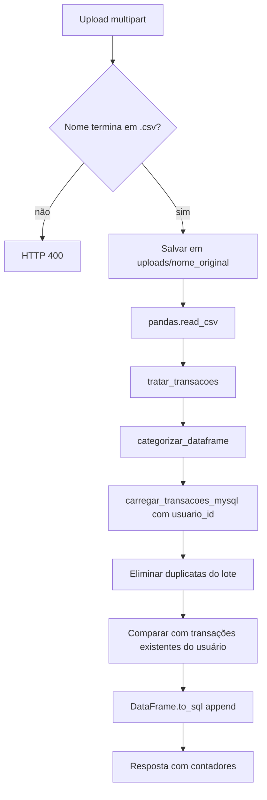

# Pipeline ETL

## Entradas existentes

O repositório contém:

- `data/raw/transacoes_exemplo.csv`, com dados brutos;
- `data/processed/transacoes_tratadas.csv`, com exemplo processado;
- rota web `POST /api/upload`, usada pelo dashboard;
- módulos `extract.py`, `transform.py`, `categorization.py` e `load.py`;
- uma entrada standalone em `src/main.py`.

## Colunas esperadas

```text
data, descricao, categoria, tipo, valor, conta, instituicao, status
```

O transformador acessa diretamente `data`, `valor`, `tipo`, `status` e `categoria`; a categorização depende de `descricao` e `categoria`.

## Pipeline web efetivamente conectado



### 1. Extração

Na rota web, o Flask salva o arquivo e chama `pandas.read_csv()` diretamente. O módulo `src/extract.py` oferece `ler_csv(caminho_arquivo)`, usado pela entrada standalone, e converte ausência do arquivo em `FileNotFoundError` com mensagem contextualizada.

### 2. Transformação

`tratar_transacoes(df)` realiza, nesta ordem:

1. Remove linhas duplicadas completas.
2. Converte nomes das colunas para minúsculas.
3. Converte `data` com `pandas.to_datetime`.
4. Converte `valor` com `pandas.to_numeric`.
5. Normaliza `tipo` para minúsculas e mapeia `receita → entrada` e `despesa → saida`.
6. Normaliza `status` para minúsculas e mapeia `concluído`/`concluido → confirmado`.
7. Preenche categoria ausente como `outros`.
8. Inicializa categorias padrão para o usuário disponível no contexto.
9. Obtém palavras-chave das categorias persistidas.
10. Categoriza automaticamente descrições cuja categoria está vazia ou é `outros`.
11. Remove registros sem valor ou data.
12. Retorna a tupla `(DataFrame tratado, quantidade categorizada)`.

### 3. Categorização

`categorization.py`:

- converte descrições para minúsculas;
- remove espaços excedentes e acentos;
- preserva categoria já preenchida e diferente de `outros`;
- procura cada palavra-chave como substring da descrição;
- usa `outros` quando não encontra correspondência;
- conta quantas linhas receberam categorização automática.

As regras padrão abrangem transporte, alimentação, lazer, saúde, casa, salário, investimentos e outros. Em operação web, as regras são lidas das categorias do usuário.

### 4. Carga

`carregar_transacoes_mysql(df, usuario_id)`:

- renomeia `data` para `data_transacao`;
- adiciona colunas ausentes com `None`;
- associa todas as linhas ao usuário recebido;
- converte data com `errors="coerce"` e valor numérico arredondado a duas casas;
- normaliza campos textuais com `strip()` e minúsculas;
- remove linhas inválidas em data ou valor;
- elimina duplicatas internas usando todas as colunas de carga;
- consulta somente transações existentes do mesmo usuário;
- cria chaves textuais concatenadas para remover registros já persistidos;
- troca strings vazias de conta e instituição por `None`;
- grava os restantes com `to_sql(..., if_exists="append")`;
- retorna `recebidos`, `importados` e `ignorados`.

### Identidade lógica de duplicata

```text
usuario_id + data_transacao + descricao + categoria + tipo + valor + conta + instituicao + status
```

Essa identidade existe no código, não como restrição única do schema.

## Saída web

A resposta de sucesso informa:

```json
{
  "mensagem": "Planilha processada com sucesso.",
  "recebidos": 0,
  "importados": 0,
  "ignorados": 0,
  "categorizadas_automaticamente": 0
}
```

Os zeros representam a forma do objeto, não valores fixos.

## Pipeline standalone

`src/main.py` pretende executar:

1. leitura de `data/raw/transacoes_exemplo.csv`;
2. tratamento;
3. escrita em `data/processed/transacoes_tratadas.csv`;
4. carga no MySQL.

Entretanto, a entrada standalone está incompatível com as assinaturas atuais:

- trata o retorno de `tratar_transacoes()` como um único DataFrame, embora seja uma tupla;
- chama `carregar_transacoes_mysql(df_tratado)` sem o `usuario_id` obrigatório.

Por isso, o fluxo web é o pipeline conectado de forma coerente ao estado atual; os detalhes do problema standalone estão em [[06-erros-e-aprendizados]].

## Limpeza

`DELETE /api/transacoes/limpar` chama `limpar_transacoes_mysql(usuario_id=...)`, removendo apenas transações do usuário da sessão. A função interna também possui um modo sem usuário que apaga toda a tabela, mas a rota não usa esse modo.

## Fontes

`app.py`, `src/extract.py`, `src/transform.py`, `src/categorization.py`, `src/load.py`, `src/main.py` e os CSVs de `data/`.
