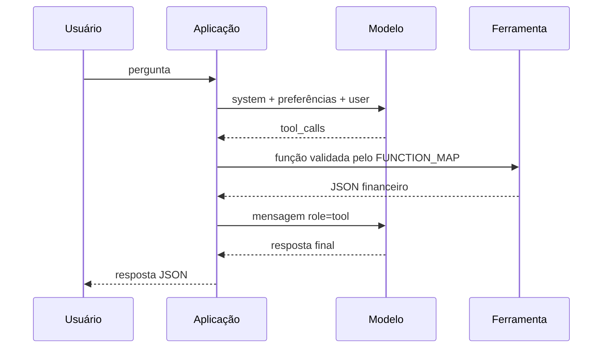

# Prompts utilizados

## Escopo confirmado

O único prompt de modelo explicitamente persistido no código está em `src/ai_financial_agent.py`. O repositório não contém histórico dos prompts usados para desenvolver o projeto. O agente local de `src/financial_agent.py` não usa LLM nem prompt: ele trabalha com listas de termos, normalização e regras de intenção.

## Modelo e chamada

- SDK: `openai`.
- Chave: `OPENAI_API_KEY`.
- Modelo: `OPENAI_MODEL`, com fallback `gpt-4o-mini`.
- API chamada: `client.chat.completions.create()`.
- Seleção de ferramenta: `tool_choice="auto"`.
- Máximo de iterações: 4.

## Prompt de sistema

Texto definido em `SYSTEM_INSTRUCTION`:

```text
Você é um assistente financeiro do Personal Finance Flow. Responda em português do Brasil.

Regras importantes:
1. Utilize exclusivamente as ferramentas fornecidas para obter números financeiros.
2. Nunca invente valores, categorias, metas ou transações.
3. Quando faltarem dados, informe claramente ao usuário.
4. Não forneça recomendações de investimento personalizadas ou aconselhamento financeiro.
5. Diferencie consultas de uma categoria específica do total geral de saídas.
6. Se o usuário mencionar uma categoria específica (alimentação, transporte, casa, etc), use a função consultar_gastos_categoria em vez de consultar_total_saidas.
7. Se não encontrar uma categoria mencionada, use listar_categorias_disponiveis para informar as opções.
8. Seja conciso e direto nas respostas.
9. Formate valores monetários conforme a moeda indicada nas preferências abaixo, sem converter os valores.
10. Não execute código, não acesse arquivos, não execute SQL.
```

## Instrução dinâmica de preferências

O sistema anexa ao prompt:

```text
Preferências do usuário: moeda {moeda}; formato de data {formato_data}.
```

Os valores vêm de `configuracoes_usuario` para o usuário do contexto.

## Prompt do usuário

A pergunta recebida pela API é usada como mensagem `user`. Antes do envio:

- espaços externos são removidos na rota;
- perguntas vazias são rejeitadas;
- o limite é 500 caracteres;
- se `resolver_categoria()` identificar uma categoria, a mensagem vira:

```text
{pergunta original} (categoria: {categoria resolvida})
```

Caso contrário, a mensagem permanece inalterada.

## Descrições de ferramentas

As descrições também orientam o modelo. O código registra onze ferramentas:

| Ferramenta | Orientação principal |
|---|---|
| `consultar_saldo` | Saldo e situação financeira geral |
| `consultar_total_entradas` | Total recebido, entradas e rendimentos |
| `consultar_total_saidas` | Despesas gerais sem categoria específica |
| `consultar_gastos_categoria` | Gasto de uma categoria; prioridade quando ela é mencionada |
| `consultar_maior_categoria` | Categoria com maior gasto |
| `consultar_total_investido` | Total registrado como investimento |
| `consultar_meta_ativa` | Objetivo, valor restante e percentual da meta |
| `consultar_quantidade_transacoes` | Quantidade total de transações |
| `consultar_ultimas_transacoes` | Movimentações recentes, limitadas pela preferência do usuário e teto 20 |
| `consultar_resumo_financeiro` | Panorama combinado das finanças |
| `listar_categorias_disponiveis` | Lista de categorias e fallback quando uma não é encontrada |

Todas possuem `additionalProperties: false`. Somente gasto por categoria exige o argumento `categoria`; transações recentes aceita `limite` opcional.

## Ciclo de function calling



O nome solicitado pelo modelo é aceito somente se existir em `FUNCTION_MAP`. Os argumentos são decodificados de JSON. O resultado é reenviado ao modelo com `ensure_ascii=False`.

## Fallback local

Qualquer exceção do agente OpenAI em `/api/assistente` aciona `responder_pergunta_local`. Esse fluxo:

- normaliza acentos e pontuação;
- identifica intenções como saldo, entradas, saídas, categorias, investimentos, metas, transações e resumo;
- consulta os mesmos dados financeiros no contexto do usuário;
- monta texto por templates Python fixos.

Não existe prompt nesse fallback.

## Restrições documentadas pelo próprio prompt

- Números devem vir das ferramentas.
- Dados não podem ser inventados.
- Ausência de dados deve ser declarada.
- Não deve haver recomendação personalizada de investimento.
- Código, arquivos e SQL estão fora do escopo do modelo.
- A moeda configura apresentação, sem conversão de montante.

## Fontes

`src/ai_financial_agent.py`, `src/financial_agent.py`, `app.py`, `.env.example` e `requirements.txt`.

Ver também [[02-arquitetura]], [[05-decisoes-tecnicas]] e [[06-erros-e-aprendizados]].
