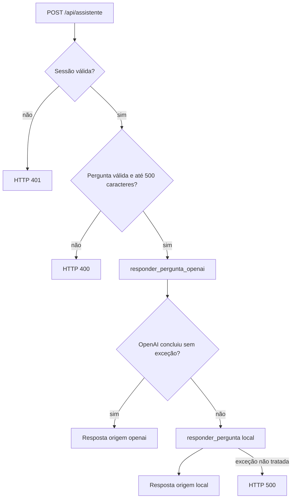
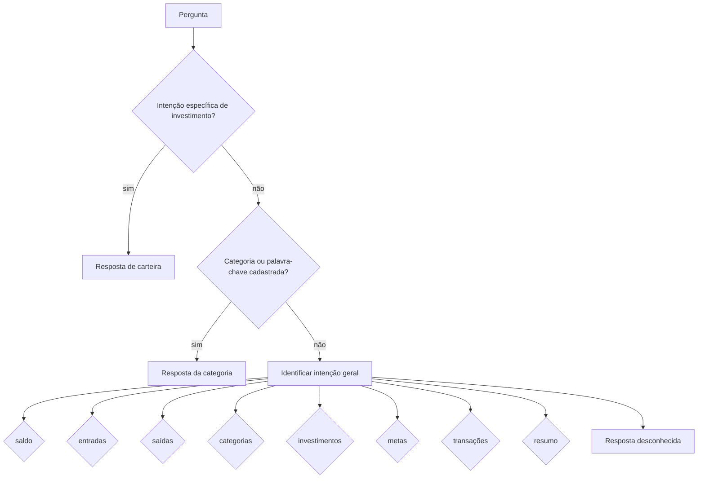

# Assistente Financeiro

## Escopo

Esta documentação descreve o comportamento atual de:

- `src/financial_agent.py`, o agente local baseado em regras;
- `src/ai_financial_agent.py`, o agente com OpenAI e function calling;
- `POST /api/assistente`, em `app.py`;
- as funções de métricas, metas, categorias, investimentos e configurações consultadas pelos agentes.

O assistente é somente leitura. Nenhum dos dois agentes possui ferramenta para criar, editar ou excluir dados financeiros.

## Objetivo do Agent

O Agent transforma perguntas em português sobre as finanças da conta ativa em respostas textuais acompanhadas dos dados usados na consulta.

O escopo implementado inclui:

- saldo, entradas e saídas;
- gastos por categoria e maior categoria de gasto;
- transações recentes e quantidade de transações;
- meta financeira ativa;
- totais de transações do tipo investimento;
- carteira de investimentos, incluindo valor aplicado, valor atual, resultado, rentabilidade, quantidade e distribuição por tipo, no agente local;
- resumo financeiro combinado.

O saldo financeiro usado por `src/metrics.py` é:

```text
entradas - saídas - transações do tipo investimento
```

As métricas e transações recentes consideram somente transações com status `confirmado`.

## Contrato da rota

### Endpoint

```http
POST /api/assistente
Content-Type: application/json
```

Corpo:

```json
{
  "pergunta": "Qual é o meu saldo?"
}
```

### Validações

| Condição | Resposta |
|---|---|
| Sessão ausente | HTTP 401 |
| Corpo ausente ou sem `pergunta` | HTTP 400 |
| Pergunta vazia | HTTP 400 |
| Mais de 500 caracteres | HTTP 400 |
| Erro não tratado no fluxo completo | HTTP 500 |

O decorator `login_obrigatorio` já bloqueia a rota sem sessão. A função da rota ainda verifica novamente `session["usuario_id"]`.

### Resposta OpenAI

```json
{
  "resposta": "Texto produzido pelo modelo.",
  "origem": "openai",
  "ferramenta": "consultar_saldo",
  "dados": {
    "saldo": 0.0,
    "entradas": 0.0,
    "saidas": 0.0,
    "investimentos": 0.0
  }
}
```

Os zeros acima demonstram apenas o formato. Os valores reais são obtidos da conta autenticada.

### Resposta do fallback local

O agente local retorna originalmente `resposta`, `tipo` e `dados`. A rota acrescenta `origem="local"` e copia `tipo` para `ferramenta`:

```json
{
  "resposta": "Texto montado pelo agente local.",
  "tipo": "entradas",
  "dados": {
    "total_entradas": 0.0
  },
  "origem": "local",
  "ferramenta": "entradas"
}
```

O frontend usa somente `dados.resposta` para exibir a mensagem.

## Fontes de dados

| Fonte | Módulo | Uso |
|---|---|---|
| `transacoes` | `src/metrics.py` | Saldo, entradas, saídas, total investido, quantidade, maior gasto, resumo e recentes |
| `transacoes` | `src/categorias.py` | Quantidade e valor total de uma categoria |
| `categorias` | `src/categorias.py` | Nomes e palavras-chave para identificar categorias mencionadas |
| `metas` | `src/metas.py` | Meta ativa mais recente do usuário |
| `investimentos` | `src/investimentos.py` | Carteira detalhada usada pelo agente local |
| `configuracoes_usuario` | `src/configuracoes.py` | Moeda, formato de data e limite de transações recentes |

### Semânticas importantes

- `calcular_resumo_financeiro()` lê somente transações confirmadas do usuário.
- `calcular_gastos_por_categoria()` considera somente saídas confirmadas.
- `buscar_ultimas_transacoes()` considera somente confirmadas e ordena por data e ID decrescentes.
- `obter_estatisticas_categoria()` soma todas as transações da categoria do usuário, sem filtro explícito de tipo ou status.
- `buscar_meta_ativa()` retorna a meta `ativa` mais recente por ID.
- `obter_resumo_investimentos()` calcula valores monetários somente para investimentos `ativo`, mas `quantidade_total` inclui todos os status.
- A moeda altera a formatação da resposta; não existe conversão de montantes.

## Ferramentas disponíveis para a OpenAI

O agente OpenAI expõe 11 funções com `additionalProperties: false`.

| Ferramenta | Argumentos | Resultado principal | Fonte |
|---|---|---|---|
| `consultar_saldo` | nenhum | Saldo, entradas, saídas e investimento | Métricas de transações confirmadas |
| `consultar_total_entradas` | nenhum | Total de entradas | Métricas |
| `consultar_total_saidas` | nenhum | Total de saídas | Métricas |
| `consultar_gastos_categoria` | `categoria`, obrigatório | Valor e quantidade da categoria | Estatísticas de categoria |
| `consultar_maior_categoria` | nenhum | Categoria com maior saída confirmada | Gastos por categoria |
| `consultar_total_investido` | nenhum | Total das transações confirmadas do tipo investimento | Métricas |
| `consultar_meta_ativa` | nenhum | Título, valores, percentual e falta | Meta ativa |
| `consultar_quantidade_transacoes` | nenhum | Quantidade de transações confirmadas | Métricas |
| `consultar_ultimas_transacoes` | `limite`, opcional | Lista recente e quantidade | Métricas e configuração do usuário |
| `consultar_resumo_financeiro` | nenhum | Saldo, totais, categorias e meta | Métricas, categorias e meta |
| `listar_categorias_disponiveis` | nenhum | Categorias e palavras-chave | Categorias do usuário |

O limite solicitado para transações recentes é restringido ao menor valor entre:

- o argumento da tool, quando fornecido;
- a preferência `qtd_transacoes_recentes` do usuário;
- o teto 20.

### Diferença entre “investimento” nas duas fontes

`consultar_total_investido` consulta transações financeiras cujo `tipo` é `investimento`. Ela não consulta a tabela `investimentos`.

As consultas detalhadas da carteira — total aplicado, valor atual, lucro/prejuízo, rentabilidade, quantidade e tipo de ativo — existem no agente local, que usa `obter_resumo_investimentos()` e `listar_investimentos()`. Não existem tools OpenAI equivalentes no estado atual.

## Fluxo de decisão da rota



O fallback é acionado por exceção lançada pelo fluxo OpenAI, por exemplo:

- cliente OpenAI não inicializado;
- erro na chamada remota;
- erro fora dos tratamentos internos do agente OpenAI.

As funções individuais das tools normalmente capturam suas próprias exceções e retornam `{"erro": "..."}`. Nesses casos, a rota não muda automaticamente para o agente local; o erro da tool é reenviado ao modelo.

## Uso da OpenAI

### Configuração

```text
OPENAI_API_KEY
OPENAI_MODEL, padrão gpt-4o-mini
```

O cliente é criado durante a importação de `src/ai_financial_agent.py` quando `OPENAI_API_KEY` já está disponível em `os.environ`. O próprio módulo não chama `load_dotenv()` antes de ler a chave.

Embora o comentário do arquivo mencione “Responses API”, a implementação chama:

```text
client.chat.completions.create(...)
```

### Prompt de sistema

O prompt instrui o modelo a:

- responder em português do Brasil;
- obter números exclusivamente pelas tools;
- não inventar dados;
- declarar ausência de dados;
- não fornecer recomendação personalizada de investimento;
- diferenciar categoria específica de total geral;
- ser conciso;
- formatar valores conforme a preferência do usuário, sem conversão;
- não executar código, acessar arquivos ou executar SQL.

O backend acrescenta ao prompt a moeda e o formato de data do usuário.

### Contextualização da pergunta

Antes de chamar o modelo, o agente tenta identificar uma categoria pelo nome ou pelas palavras-chave cadastradas. Quando encontra, envia:

```text
{pergunta original} (categoria: {categoria})
```

Caso contrário, envia a pergunta original.

### Function calling

1. Montar mensagens `system` e `user`.
2. Chamar Chat Completions com as tools e `tool_choice="auto"`.
3. Validar o nome solicitado contra `FUNCTION_MAP`.
4. Decodificar argumentos JSON.
5. Executar a função no contexto do usuário.
6. Enviar o resultado como mensagem `tool`.
7. Repetir até obter texto final ou atingir quatro iterações.

Ao obter resposta textual, o retorno contém a última ferramenta executada e seu resultado em `dados`.

### Priorização de "maior categoria de gasto"

Quando a pergunta contém termos como "maior categoria", "categoria de gasto", "onde mais gastei", "onde eu mais gastei", "em que mais gastei", "com o que mais gastei", "maior gasto" ou "maior despesa", o agente OpenAI é forçado a usar a ferramenta `consultar_maior_categoria` na primeira iteração. Isso evita que o modelo interprete a pergunta apenas como uma consulta de total de saídas.

### Histórico de mensagens

Quando o modelo solicita chamadas de ferramentas (`tool_calls`), a mensagem do assistente contendo essas solicitações é adicionada ao histórico antes dos resultados das ferramentas serem enviados. Isso garante que o contexto da conversa inclua tanto a intenção do modelo quanto os dados retornados pelas tools.

Se as quatro iterações forem consumidas, a função retorna uma resposta estática com `origem="local"`, embora não invoque `responder_pergunta_local()` nesse ramo específico.

## Fallback local

O fallback não usa LLM. Ele normaliza texto para minúsculas, remove acentos e, em alguns caminhos, pontuação.

### Ordem de decisão



Investimentos têm prioridade porque perguntas sobre carteira podem conter palavras como saldo, rendimento ou quantidade. O agente reconhece:

- resultado, lucro ou prejuízo;
- rentabilidade;
- valor atual;
- total aplicado;
- quantidade de ativos;
- resumo da carteira;
- tipos conhecidos ou cadastrados, como CDB, LCI, LCA, Tesouro Direto, ações, ETF, FII e criptomoeda.

Depois, o agente procura categorias cadastradas pelo usuário. Por fim, verifica as intenções gerais na ordem em que aparecem em `INTENCOES`.

### Formatação local

`src/utils.py` aplica a moeda e o formato de data do usuário. A resposta local é construída com textos determinísticos e objetos `dados`.

## Segurança e isolamento por usuário

O isolamento ocorre em camadas:

1. `login_obrigatorio` exige sessão para acessar a rota.
2. `before_request` copia `session["usuario_id"]` para um `ContextVar`.
3. Os dois agentes chamam `_obter_usuario_id_da_sessao()`, que rejeita contexto sem usuário.
4. As tools passam `usuario_id` explicitamente para métricas, metas e categorias.
5. O agente local passa o mesmo identificador também para investimentos.
6. As consultas SQL usadas por esses caminhos aplicam `WHERE usuario_id = :usuario_id`.
7. `teardown_request` limpa o `ContextVar` ao final da requisição.

### Fronteira da OpenAI

O modelo não recebe conexão de banco, função SQL genérica nem acesso aos arquivos. Ele pode solicitar somente nomes presentes em `FUNCTION_MAP`.

Ainda assim, a integração envia à OpenAI:

- a pergunta do usuário;
- o prompt com moeda e formato de data;
- os resultados financeiros retornados pelas tools necessárias.

O código também registra no console a pergunta, o nome da tool e seus argumentos. Esses pontos são relevantes para a política operacional de privacidade e logs.

## Exemplos de perguntas e respostas

Os valores abaixo usam marcadores porque dependem dos dados e preferências do usuário. A redação OpenAI pode variar; a coluna “resposta típica” segue os formatos do agente local ou o conteúdo esperado da tool.

| Pergunta | Caminho provável | Resposta típica |
|---|---|---|
| “Qual é o meu saldo?” | `consultar_saldo` ou `responder_saldo` | “Seu saldo atual é positivo em `{moeda} {valor}`.” |
| “Quanto recebi?” | `consultar_total_entradas` ou `responder_entradas` | “O total de entradas é `{moeda} {valor}`.” |
| “Quanto gastei?” | `consultar_total_saidas` ou `responder_saidas` | “O total de saídas é `{moeda} {valor}`.” |
| “Quanto gastei com alimentação?” | `consultar_gastos_categoria` ou resposta de categoria | “Você gastou `{moeda} {valor}` com `alimentação`.” |
| “Onde eu mais gastei?” | `consultar_maior_categoria` ou análise local | “Sua maior categoria de gastos foi `{categoria}`, com `{moeda} {valor}`.” |
| “Como está minha meta?” | `consultar_meta_ativa` ou `responder_metas` | “Sua meta ‘`{título}`’ está `{percentual}%` concluída...” |
| “Quantas transações tenho?” | `consultar_quantidade_transacoes` | “Você tem `{quantidade}` transações registradas.” |
| “Qual foi minha última transação?” | `consultar_ultimas_transacoes` com limite 1 | “Sua última transação foi `{descrição}` de `{valor}` em `{data}`.” |
| “Quais foram minhas últimas transações?” | Tool ou fallback respeitando a preferência | Lista com descrição, valor e data |
| “Faça um resumo das minhas finanças.” | `consultar_resumo_financeiro` ou `responder_resumo` | Texto combinado com entradas, saídas, saldo, categoria, meta e, no fallback, carteira |
| “Quanto tenho em transações de investimento?” | `consultar_total_investido` | Total de transações confirmadas do tipo investimento |
| “Quanto vale minha carteira hoje?” | Intenção local de investimento | “O valor atual da sua carteira de investimentos é `{moeda} {valor}`.” |
| “Minha carteira teve lucro?” | Intenção local de resultado | “Sua carteira apresenta lucro/prejuízo de `{moeda} {valor}`.” |
| “Qual a rentabilidade da carteira?” | Intenção local de rentabilidade | Resposta percentual calculada sobre investimentos ativos |

### Ausência de dados

Exemplos determinísticos do fallback:

- “Não há entradas registradas.”
- “Não há saídas registradas.”
- “Você ainda não possui uma meta financeira ativa.”
- “Não há transações registradas.”
- “Você ainda não possui investimentos cadastrados.”

### Pergunta não reconhecida

O agente local orienta o usuário a perguntar sobre saldo, entradas, saídas, categorias, investimentos, metas ou últimas transações.

## Limitações confirmadas

- O agente OpenAI não possui tools para consultar a carteira detalhada da tabela `investimentos`.
- `resolver_categoria()` no agente OpenAI referencia `palavra_normalizado`, mas a variável criada se chama `palavra_normalizada`. A exceção é capturada e a função retorna `None`, podendo impedir a contextualização por palavra-chave.
- As estatísticas de categoria e os gastos por categoria não têm exatamente o mesmo filtro: a primeira não limita tipo/status; a segunda considera saídas confirmadas.
- O cabeçalho de `ai_financial_agent.py` cita Responses API, mas o código usa Chat Completions.
- O agente não mantém histórico de conversa no backend; cada envio constrói uma nova lista de mensagens.
- O frontend exibe somente o texto de resposta e não apresenta `origem`, `ferramenta` ou `dados`.

## Referências no projeto

- `app.py`: contexto de usuário e rota `/api/assistente`.
- `src/ai_financial_agent.py`: tools, prompt e integração OpenAI.
- `src/financial_agent.py`: reconhecimento de intenção e fallback.
- `src/metrics.py`: métricas sobre transações confirmadas.
- `src/categorias.py`: categorias e estatísticas.
- `src/metas.py`: meta ativa.
- `src/investimentos.py`: carteira detalhada.
- `src/configuracoes.py` e `src/utils.py`: preferências e formatação.
- `static/js/assistente.js`: envio da pergunta e exibição da resposta.
