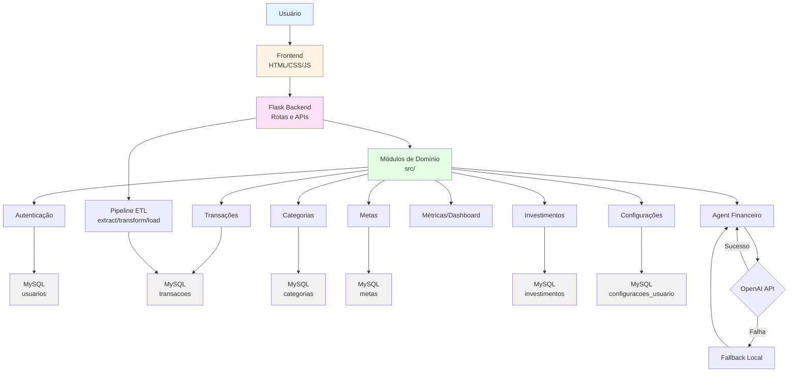

# PRD Geral

## Contextualização

Este documento agrupa as diretrizes gerais para todos os PRDs específicos do Personal Finance Flow.

## Arquitetura Funcional Geral

O sistema segue uma arquitetura funcional baseada em módulos de domínio, com fluxo de dados centralizado através do backend Flask.

**Explicação:** O diagrama mostra o fluxo funcional geral do sistema, desde a interação do usuário através do frontend até os módulos de domínio no backend, que por sua vez interagem com o banco de dados MySQL. O pipeline ETL processa uploads CSV e o Agent Financeiro usa um sistema híbrido com OpenAI e fallback local.

## Princípios Gerais

1. **Privacidade primeiro**: Dados dos usuários nunca são enviados para servidores terceiros sem consentimento explícito
2. **Simplicidade**: Interface intuitiva, sem sobrecarga de funcionalidades
3. **Desempenho**: Resposta rápida, mesmo com muitos dados
4. **Extensibilidade**: Arquitetura modular para adicionar novas funcionalidades
5. **Segurança**: Senhas hasheadas, isolamento de dados, SQL parametrizado

## Stack Tecnológica Padronizada

- Backend: Python 3.9+, Flask 3.1.3
- Banco: MySQL via PyMySQL + SQLAlchemy 2.0.50
- Dados: Pandas 2.3.3
- Frontend: HTML, CSS, JavaScript vanilla + Chart.js
- IA (opcional): OpenAI API (GPT-4o-mini) com function calling
