# PRD 03: Autenticação

## Objetivo

Implementar cadastro e login de usuários com segurança.

## Fluxo de Autenticação

```mermaid
flowchart TD
    subgraph Cadastro
        A1[Usuário acessa /cadastro] --> A2[Preenche formulário]
        A2 --> A3{Validações}
        A3 -->|Nome < 3 chars| A4[Erro: nome muito curto]
        A3 -->|Email inválido| A5[Erro: email inválido]
        A3 -->|Senha < 6 chars| A6[Erro: senha muito curta]
        A3 -->|Senhas não coincidem| A7[Erro: senhas diferentes]
        A3 -->|Email já existe| A8[Erro: email já cadastrado]
        A3 -->|Todas válidas| A9[Gerar hash PBKDF2-SHA256]
        A9 --> A10[Inserir no MySQL]
        A10 --> A11[Criar categorias padrão]
        A11 --> A12[Redirecionar para /login]
    end
    
    subgraph Login
        B1[Usuário acessa /login] --> B2[Informa email e senha]
        B2 --> B3{Validações}
        B3 -->|Email não encontrado| B4[Erro: usuário não encontrado]
        B3 -->|Senha incorreta| B5[Erro: senha incorreta]
        B3 -->|Credenciais válidas| B6[Criar sessão Flask]
        B6 --> B7[Armazenar usuario_id, nome, email]
        B7 --> B8[Redirecionar para /dashboard]
    end
    
    subgraph Logout
        C1[Usuário clica em logout] --> C2[Invalidar sessão]
        C2 --> C3[Redirecionar para /login]
    end
    
    style A4 fill:#ffcccc
    style A5 fill:#ffcccc
    style A6 fill:#ffcccc
    style A7 fill:#ffcccc
    style A8 fill:#ffcccc
    style B4 fill:#ffcccc
    style B5 fill:#ffcccc
    style A12 fill:#ccffcc
    style B8 fill:#ccffcc
    style C3 fill:#ccffcc
```

**Explicação:** O diagrama mostra o fluxo completo de autenticação, incluindo cadastro com validações, criação de hash de senha, inicialização de categorias padrão, login com verificação de credenciais e criação de sessão, e logout com invalidação de sessão.

## Funcionalidades

### Cadastro

- Campos obrigatórios: nome, email, senha, confirmação de senha
- Campo opcional: telefone
- Validações:
  - Nome ≥ 3 caracteres
  - Email válido
  - Senha ≥ 6 caracteres
  - Senha e confirmação coincidem
  - Email único no sistema
- Senha armazenada como hash PBKDF2-SHA256 (nunca texto plano)

### Login

- Campos: email, senha
- Valida credenciais contra hash armazenado
- Cria sessão Flask com `usuario_id`, `usuario_nome`, `usuario_email`

## Critérios de Aceitação

- [ ] Página de cadastro funcional
- [ ] Página de login funcional
- [ ] Senhas armazenadas como hash
- [ ] Sessão criada após login
