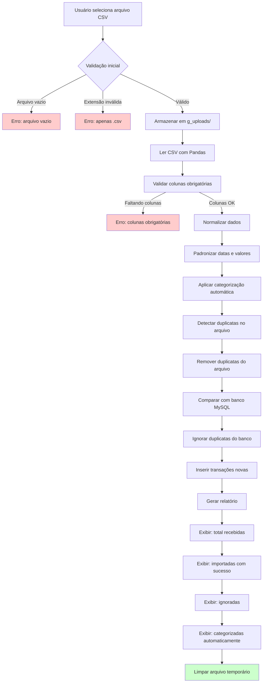

# PRD 06: Upload CSV

## Objetivo

Interface para usuário enviar arquivos CSV e visualizar resultado do pipeline ETL.

## Fluxo de Importação CSV

**Explicação:** O diagrama mostra o fluxo completo de importação CSV, desde a seleção do arquivo pelo usuário até a exibição do relatório final, incluindo validações, normalização, categorização automática, deduplicação e carga no banco MySQL.

## Funcionalidades

### Upload

- Área de drop/upload no dashboard
- Aceita apenas arquivos `.csv`
- Valida:
  - Arquivo não está vazio
  - Extensão correta
- Armazena arquivo temporariamente em `g_uploads/`

### Feedback

- Mostra progresso durante o processamento
- Apresenta relatório com:
  - Total de linhas recebidas
  - Total importadas com sucesso
  - Total ignoradas (duplicatas ou inválidas)
  - Total categorizadas automaticamente

## Critérios de Aceitação

- [ ] Upload funcional com validação
- [ ] Relatório de resultado exibido
- [ ] Arquivos temporários são limpos após uso
