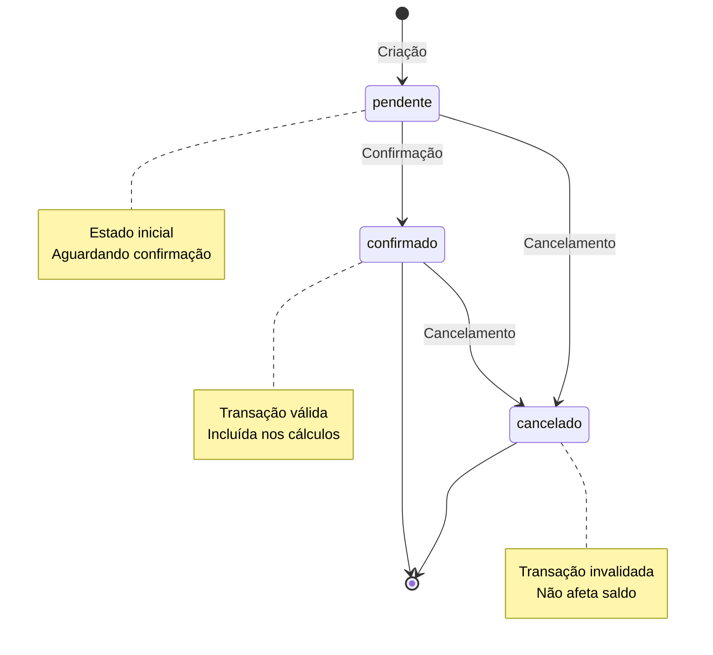

# PRD 07: Transações

## Objetivo

CRUD completo de transações financeiras.

## Estados de Transação

**Explicação:** O diagrama mostra os estados possíveis de uma transação: pendente (estado inicial), confirmado (transação válida) e cancelado (transação invalidada). Transações podem ser confirmadas ou canceladas a partir do estado pendente, e transações confirmadas podem ser canceladas.

## Funcionalidades

### Listagem

- Mostra transações do usuário logado
- Filtros:
  - Por descrição (busca textual)
  - Por categoria
  - Por tipo (entrada/saída/investimento)
  - Por status (confirmado/pendente/cancelado)
- Ordenada por data decrescente

### Criação/Edição

- Campos obrigatórios:
  - Data
  - Descrição
  - Tipo (entrada/saída/investimento)
  - Valor (> 0)
  - Status
- Campo opcional: categoria
- Se categoria não informada, sugere baseada em regras

### Exclusão

- Confirmação antes de excluir (configurável pelo usuário)
- Remove apenas transação do usuário logado

## Critérios de Aceitação

- [ ] Listagem com filtros funcional
- [ ] Criação/edição com validações
- [ ] Exclusão com confirmação
- [ ] Todas operações respeitam `usuario_id`
