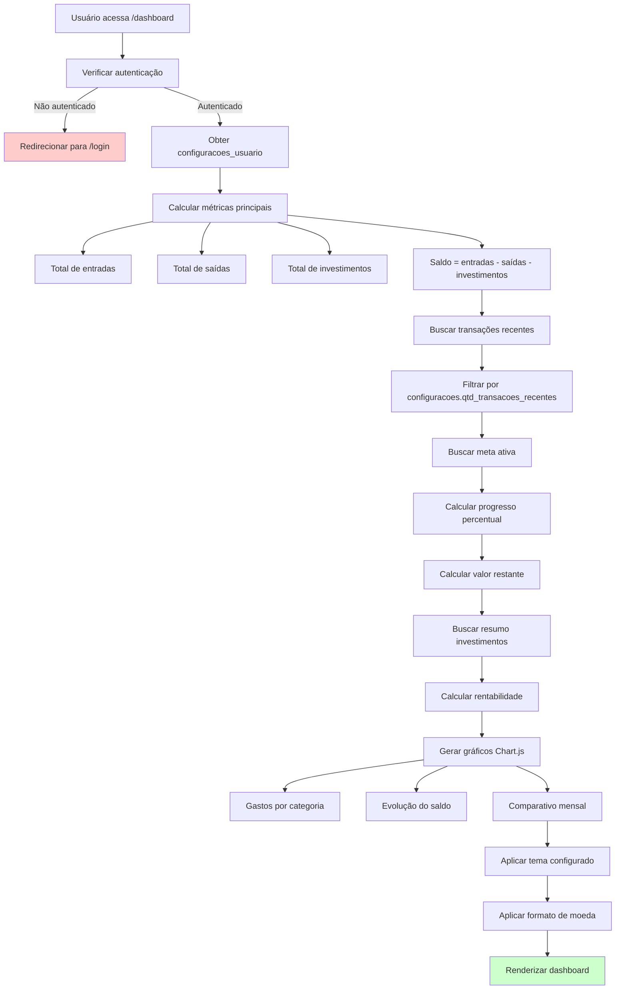

# PRD 08: Dashboard

## Objetivo

Página principal com visão geral das finanças do usuário.

## Fluxo de Geração do Dashboard

**Explicação:** O diagrama mostra o fluxo de geração do dashboard, desde a verificação de autenticação até a renderização final. O sistema obtém as configurações do usuário, calcula métricas financeiras, busca transações recentes, meta ativa e resumo de investimentos, gera gráficos com Chart.js e aplica as preferências de tema e moeda do usuário.

## Funcionalidades

### Cards de Métricas

- Total de entradas (período padrão)
- Total de saídas
- Total de investimentos
- Saldo calculado (entradas - saídas - investimentos)
- Cards visíveis configuráveis pelo usuário

### Gráficos (Chart.js)

- Gastos por categoria (gráfico de pizza/rosca)
- Evolução do saldo ao longo do tempo (linha)
- Comparativo entradas vs saídas mensais (barras)

### Outras Seções

- Transações recentes confirmadas (quantidade configurável)
- Resumo da meta ativa
- Resumo da carteira de investimentos
- Insights automáticos

## Critérios de Aceitação

- [ ] Todas as métricas calculadas corretamente
- [ ] Gráficos renderizados sem erros
- [ ] Atualizado em tempo real após alterações
- [ ] Respeita configurações do usuário (tema, moeda, etc.)
