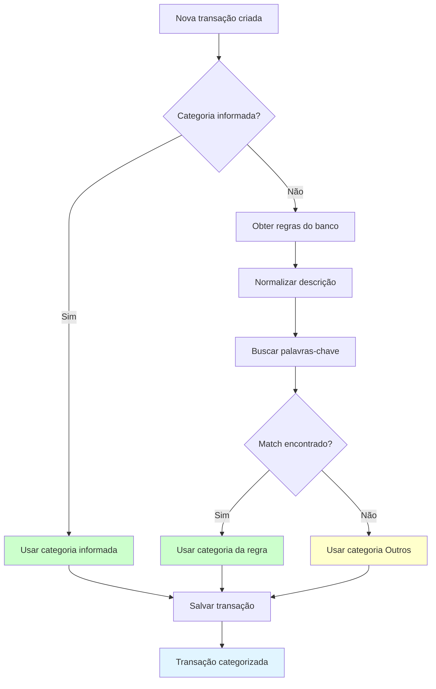

# PRD 09: Categorias

## Objetivo

Gestão de categorias de transações e regras de categorização automática.

## Fluxo de Categorização Automática

**Explicação:** O diagrama mostra o fluxo de categorização automática de transações. Se o usuário informar uma categoria, ela é usada diretamente. Caso contrário, o sistema busca regras de palavras-chave no banco, normaliza a descrição e tenta encontrar um match. Se encontrado, usa a categoria da regra; caso contrário, usa a categoria "Outros".

## Funcionalidades

### Categorias Padrão

São criadas automaticamente para novos usuários:
- Transporte
- Alimentação
- Lazer
- Saúde
- Casa
- Salário
- Investimentos
- Outros (não pode ser excluída)

### CRUD de Categorias

- Campos: nome, cor, palavras-chave (JSON)
- Exclusão:
  - "Outros" não pode ser excluída
  - Se excluir categoria com transações, move elas para "Outros"

### Categorização Automática

- Baseada em palavras-chave
- Ao importar CSV ou criar transação manualmente, verifica descrição contra regras
- Usuário pode adicionar/remover palavras-chave nas categorias

## Critérios de Aceitação

- [ ] Categorias padrão são criadas para novo usuário
- [ ] CRUD completo funcional
- [ ] "Outros" não pode ser excluída
- [ ] Categorização automática funciona
