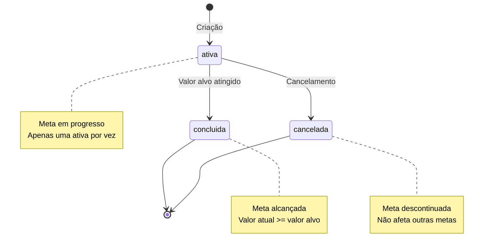

# PRD 10: Metas

## Objetivo

Permitir usuário definir e acompanhar metas financeiras.

## Estados de Meta

**Explicação:** O diagrama mostra os estados possíveis de uma meta: ativa (meta em progresso), concluída (valor alvo atingido) e cancelada (meta descontinuada). Apenas uma meta pode estar ativa por vez. Metas ativas podem ser concluídas ao atingir o valor alvo ou canceladas pelo usuário.

## Funcionalidades

### CRUD de Metas

- Campos:
  - Título (obrigatório)
  - Valor alvo (> 0, obrigatório)
  - Valor atual (≥ 0)
  - Status (ativa/concluída/cancelada)
- Apenas uma meta pode estar com status "ativa" por vez

### Acompanhamento

- Cálculo automático do progresso percentual (teto de 100%)
- Cálculo do valor restante (piso de 0)
- Visualização no dashboard

## Critérios de Aceitação

- [ ] CRUD completo funcional
- [ ] Apenas uma meta ativa permitida
- [ ] Cálculos de progresso corretos
- [ ] Visualização no dashboard
