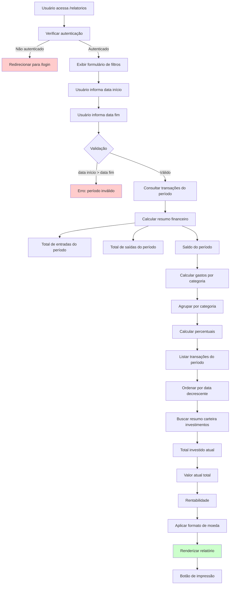

# PRD 11: Relatórios

## Objetivo

Relatórios financeiros por período selecionado.

## Fluxo de Geração de Relatórios

**Explicação:** O diagrama mostra o fluxo de geração de relatórios, desde a seleção do período até a renderização final. O sistema valida as datas, consulta transações do período, calcula resumo financeiro, gastos por categoria, lista transações e busca resumo da carteira de investimentos, aplicando o formato de moeda configurado pelo usuário.

## Funcionalidades

### Filtros

- Data início (YYYY-MM-DD)
- Data fim (YYYY-MM-DD)
- Valida que data início ≤ data fim

### Conteúdo do Relatório

- Resumo financeiro do período (entradas, saídas, saldo)
- Gastos por categoria no período
- Lista de transações do período
- Resumo da carteira de investimentos (atual, não por período)
- Botão de impressão

## Critérios de Aceitação

- [ ] Filtros por período funcionais
- [ ] Dados do período corretos
- [ ] Impressão formatada
