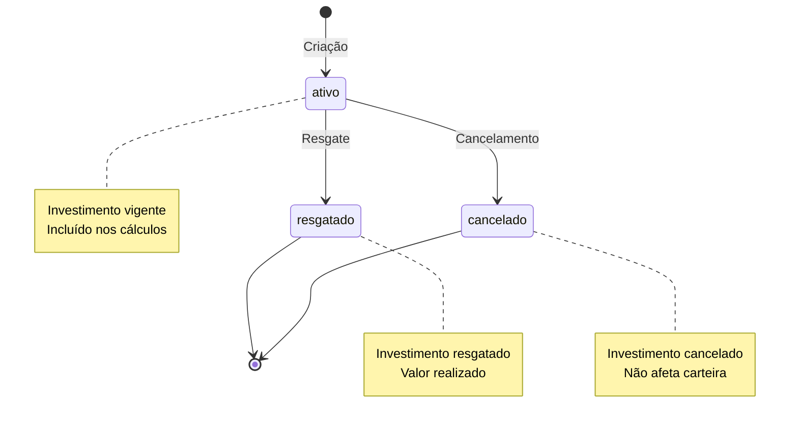

# PRD 12: Investimentos

## Objetivo

Gestão de carteira de investimentos.

## Estados de Investimento

**Explicação:** O diagrama mostra os estados possíveis de um investimento: ativo (investimento vigente), resgatado (valor realizado) e cancelado (investimento cancelado). Investimentos ativos podem ser resgatados ou cancelados pelo usuário.

## Funcionalidades

### CRUD de Investimentos

- Campos obrigatórios:
  - Nome
  - Tipo (ações, FII, ETF, CDB, LCI/LCA, Tesouro, cripto, outros)
  - Valor aplicado (> 0)
  - Valor atual (≥ 0)
  - Data de aplicação
- Campo opcional: data de vencimento (não pode ser anterior à aplicação)
- Status: ativo, resgatado, cancelado

### Resumo da Carteira

- Total investido (apenas ativos)
- Valor atual total (apenas ativos)
- Resultado total (valor atual - valor aplicado)
- Rentabilidade percentual
- Quantidade por tipo

## Critérios de Aceitação

- [ ] CRUD completo funcional
- [ ] Cálculos de resumo corretos
- [ ] Resumo exibido no dashboard
