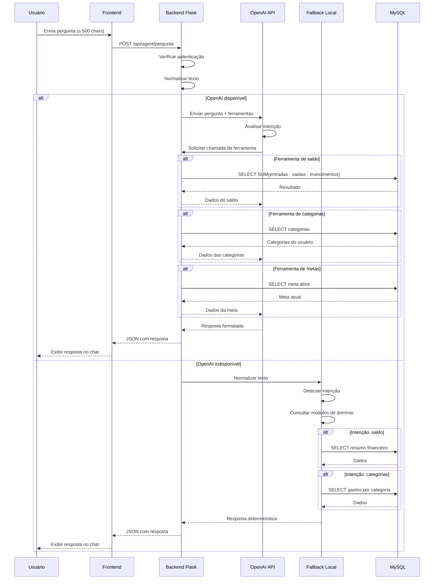

# PRD 13: Agent Financeiro

## Objetivo

Assistente conversacional que responde perguntas sobre os dados do usuário.

## Sequência do Assistente Financeiro

**Explicação:** O diagrama mostra o fluxo de interação do assistente financeiro. O sistema tenta primeiro usar a OpenAI API com function calling; se disponível, a IA analisa a intenção e solicita chamadas de ferramentas específicas para consultar o banco MySQL. Se a OpenAI falhar, o sistema usa um fallback local que normaliza o texto, detecta a intenção e consulta os módulos de domínio diretamente.

## Funcionalidades

### Sistema Híbrido

1. **Primeiro tenta OpenAI**:
   - Usa GPT-4o-mini com function calling
   - Ferramentas disponíveis: consultar saldo, entradas, saídas, categorias, meta, transações recentes, etc.
   - Prompt instrui a usar apenas ferramentas para obter dados, não inventar

2. **Fallback local**:
   - Se OpenAI falhar (sem chave, erro de API, etc.), usa regras locais
   - Normaliza texto, detecta intenção, consulta módulos de domínio, retorna resposta determinística
   - Não usa nenhum LLM

### Interface

- Chat similar a apps de mensagem
- Pergunta limitada a 500 caracteres
- Histórico durante a sessão

### Segurança

- Apenas leitura (nenhuma ferramenta de escrita)
- Apenas dados do usuário logado
- Não fornece aconselhamento financeiro personalizado

## Critérios de Aceitação

- [ ] Chat funcional
- [ ] Respostas usam dados reais
- [ ] Fallback funciona sem OpenAI
- [ ] Nenhum dado de outro usuário é exposto
