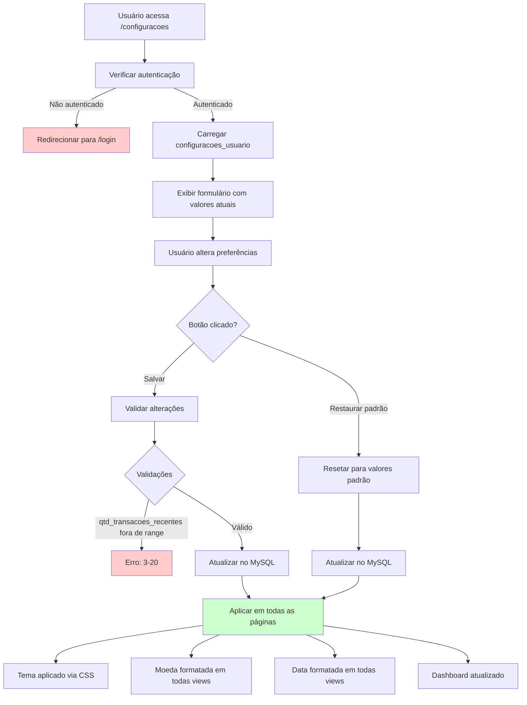

# PRD 14: Configurações

## Objetivo

Permitir usuário personalizar sua experiência no app.

## Fluxo de Configurações do Usuário

**Explicação:** O diagrama mostra o fluxo de configurações do usuário, desde o acesso à página até a aplicação das preferências. O usuário pode salvar alterações específicas ou restaurar os padrões. As configurações são aplicadas globalmente: tema via CSS, moeda e data formatadas em todas as views, e dashboard atualizado com as novas preferências.

## Funcionalidades

### Preferências Disponíveis

| Preferência | Opções | Padrão |
|---|---|---|
| Nome de exibição | Texto | (nome do cadastro) |
| Tema | Azul, Rosa, Verde, Vermelho, Escuro | Azul |
| Moeda | BRL, USD, EUR | BRL |
| Formato de data | DD/MM/YYYY, MM/DD/YYYY, YYYY-MM-DD | DD/MM/YYYY |
| Qtd transações recentes | 3-20 | 5 |
| Confirmação de exclusão | On/Off | On |
| Cards visíveis no dashboard | Checklist | (todos) |

### Funcionalidades Adicionais

- Botão "Restaurar padrão" para resetar todas preferências
- Atualização parcial: pode alterar apenas um campo sem enviar todos
- Preferências aplicadas em todas as páginas

## Critérios de Aceitação

- [ ] Todas preferências são salvas e persistem
- [ ] Tema é aplicado em todas as páginas
- [ ] Moeda e data são formatados corretamente
- [ ] Restaurar padrão funciona
