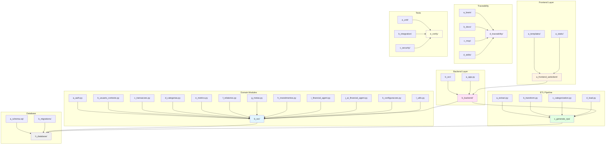
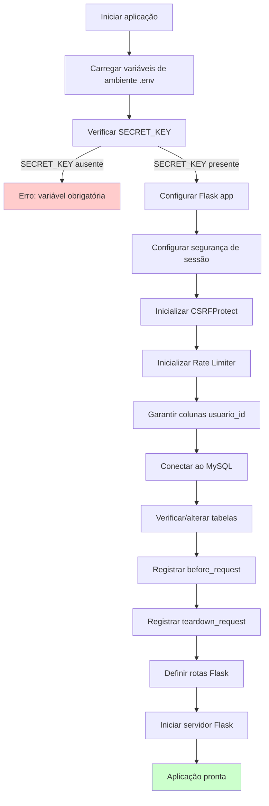

# PRD 01: Estrutura Inicial

## Objetivo

Criar a estrutura base do projeto, organização de pastas e arquivos fundamentais.

## Arquitetura de Componentes



**Explicação:** O diagrama mostra a arquitetura de componentes do sistema, organizada em camadas: Frontend (templates e estáticos), Backend (app Flask e módulos de domínio), Pipeline ETL (extract, transform, categorization, load), Database (schema e migrations), Traceability (brain, docs, MCP, skills) e Tests (unit, integration, security). O fluxo de dados vai do Frontend através do Backend para os módulos de domínio e ETL, que interagem com o Database.

## Fluxo de Inicialização da Aplicação



**Explicação:** O diagrama mostra o fluxo de inicialização da aplicação Flask. O sistema carrega variáveis de ambiente, verifica a SECRET_KEY obrigatória, configura o app Flask, inicializa proteções (CSRF, rate limiter), garante colunas de isolamento no banco, conecta ao MySQL, registra hooks de request (before_request, teardown_request), define as rotas e inicia o servidor.

## Estrutura de Pastas

```
personal-finance-flow/
├── app.py                 # Aplicação Flask principal
├── requirements.txt       # Dependências Python
├── .env.example          # Exemplo de variáveis de ambiente
├── src/                  # Módulos de domínio
├── templates/            # Templates Jinja2
├── static/               # Arquivos estáticos (CSS, JS, imagens)
├── h_database/           # Schema e migrações
├── data/                 # Dados de exemplo
├── docs/                 # Documentação
└── brain/                # Vault técnico
```

## Critérios de Aceitação

- [ ] Estrutura de pastas criada
- [ ] `requirements.txt` com dependências básicas
- [ ] `.env.example` com placeholders
- [ ] `README.md` básico com instruções de setup
