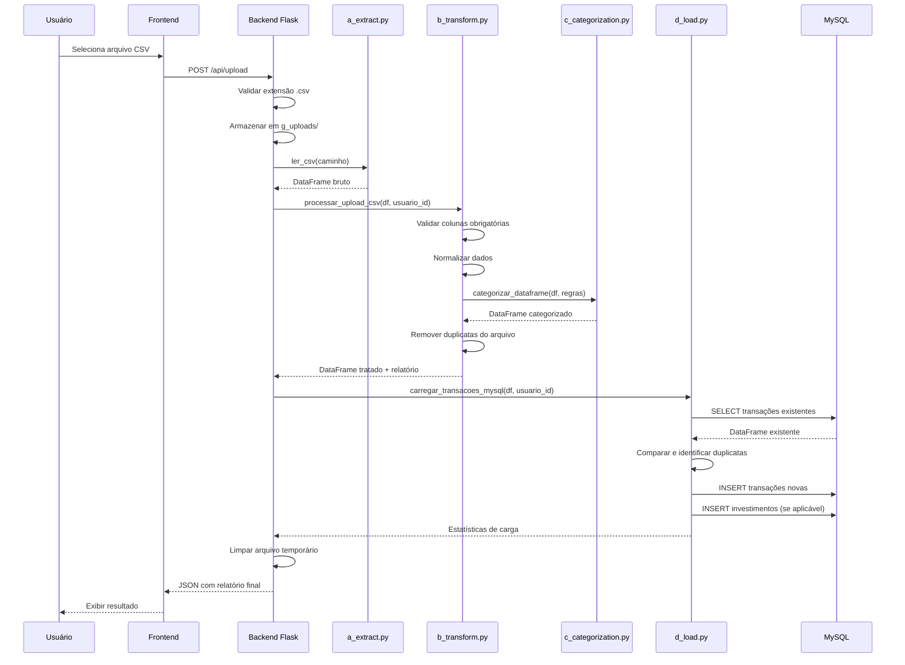

# PRD 05: Pipeline ETL

## Objetivo

Implementar pipeline de Extract, Transform, Load para importar transações de arquivos CSV.

## Pipeline ETL

**Explicação:** O diagrama mostra o pipeline ETL completo. Na fase Extract, o arquivo CSV é lido com Pandas. Na fase Transform, os dados são normalizados, validados, padronizados e categorizados automaticamente. Na fase Load, os dados são comparados com o banco MySQL para evitar duplicatas, transações novas são inseridas, investimentos são vinculados e estatísticas são retornadas.

## Sequência Técnica do Upload CSV

**Explicação:** O diagrama de sequência mostra o fluxo técnico do upload CSV, desde a seleção do arquivo pelo usuário até a exibição do resultado final. O backend coordena a chamada dos módulos ETL (extract, transform, categorization, load), que interagem com o banco MySQL para deduplicação e carga de dados.

## Etapas do Pipeline

### 1. Extract (Extração)

- Lê arquivo CSV usando Pandas
- Detecta encoding e separador automaticamente (se possível)
- Valida que as colunas mínimas existem

### 2. Transform (Transformação)

- Limpa dados:
  - Remove espaços em branco
  - Padroniza datas
  - Padroniza valores monetários
  - Normaliza texto
- Aplica categorização automática baseada em palavras-chave

### 3. Load (Carga)

- Compara linhas do CSV com transações existentes
- Ignora duplicatas
- Insere apenas transações novas no banco
- Retorna estatísticas: total recebidas, importadas, ignoradas, categorizadas

## Critérios de Aceitação

- [ ] CSV válido é processado completamente
- [ ] Dados são limpos e padronizados
- [ ] Categorização automática é aplicada
- [ ] Duplicatas são ignoradas
- [ ] Estatísticas são retornadas
