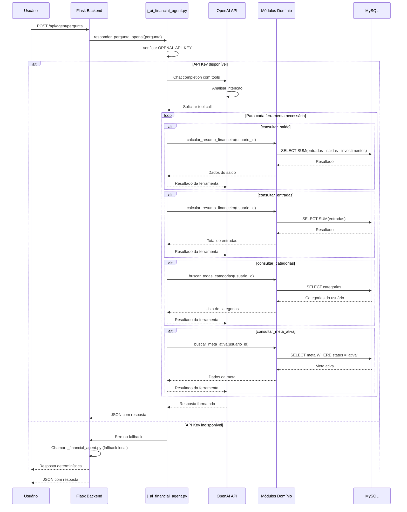

# PRD 15: Brain (Vault Técnico)

## Objetivo

Criar e manter um vault técnico com documentação detalhada do projeto.

## Sequência Técnica do Assistente Financeiro com Ferramentas e Banco



**Explicação:** O diagrama mostra a sequência técnica do assistente financeiro quando usando OpenAI. O backend chama o módulo j_ai_financial_agent.py, que interage com a OpenAI API usando function calling. A IA solicita chamadas de ferramentas específicas, que consultam os módulos de domínio, que por sua vez executam queries SELECT no MySQL. Os resultados são retornados à OpenAI, que formata a resposta final.

## Estrutura do Brain

```
brain/
├── 00-visao-geral.md
├── 01-requisitos.md
├── 02-arquitetura.md
├── 03-modelo-de-dados.md
├── 04-pipeline-etl.md
├── 05-decisoes-tecnicas.md
├── 06-erros-e-aprendizados.md
└── 07-prompts.md
```

## Conteúdo dos Arquivos

- **00-visao-geral**: Visão do produto, capacidades, stack, estrutura funcional
- **01-requisitos**: Requisitos funcionais e não funcionais, atores, restrições
- **02-arquitetura**: Camadas, módulos, fluxos, diagramas
- **03-modelo-de-dados**: Tabelas, colunas, relacionamentos
- **04-pipeline-etl**: Etapas, validações, deduplicação
- **05-decisoes-tecnicas**: Racional das escolhas de tecnologia
- **06-erros-e-aprendizados**: Problemas conhecidos, limitações
- **07-prompts**: Prompts usados na aplicação (ex: do agent)

## Critérios de Aceitação

- [ ] Todos os arquivos do brain existem
- [ ] Conteúdo é derivado do código existente
- [ ] Documentação está atualizada
