# PRD 17: MCP (Model Context Protocol Server)

## Objetivo

Implementar servidor MCP para integração com agentes/assistentes.

## Arquitetura do MCP

```mermaid
flowchart TD
    subgraph "MCP Server"
        A[a_server.py]
        B[b_schemas.py]
        C[c_allowed_resources.py]
        D[d_readonly_service.py]
        E[e_configuracao_exemplo.json]
        
        B --> A
        C --> A
        D --> A
        E --> A
    end
    
    subgraph "Ferramentas (Tools) - Apenas Leitura"
        F[consultar_saldo]
        G[consultar_entradas]
        H[consultar_saidas]
        I[consultar_categorias]
        J[consultar_meta_ativa]
        K[consultar_resumo_financeiro]
        
        F --> D
        G --> D
        H --> D
        I --> D
        J --> D
        K --> D
    end
    
    subgraph "Resources - Allowlist"
        L[Arquivos seguros]
        M[Excluir .env]
        N[Excluir dados sensíveis]
        
        L --> C
        M --> C
        N --> C
    end
    
    subgraph "Segurança"
        O[Apenas SELECT no MySQL]
        P[Usuário fixo configurado]
        Q[Sem SQL arbitrário]
        R[Sem caminhos arbitrários]
        S[Credenciais em .env]
        
        O --> D
        P --> A
        Q --> D
        R --> C
        S --> A
    end
    
    subgraph "Integração"
        T[Agentes/Assistentes]
        U[OpenAI API]
        V[Outros clientes MCP]
        
        T --> A
        U --> A
        V --> A
    end
    
    D --> W[MySQL]
    
    style A fill:#ffe1f5
    style D fill:#e1f5ff
    style W fill:#f0f0f0
    style O fill:#ccffcc
    style P fill:#ccffcc
    style Q fill:#ccffcc
    style R fill:#ccffcc
    style S fill:#ccffcc
```



**Explicação:** O diagrama mostra a arquitetura do servidor MCP, incluindo os módulos principais (server, schemas, allowed_resources, readonly_service), as ferramentas de leitura disponíveis, o sistema de allowlist de resources, as medidas de segurança (apenas SELECT, usuário fixo, sem SQL arbitrário, sem caminhos arbitrários, credenciais em .env) e a integração com agentes/assistentes e OpenAI API.

## Estrutura do MCP

```
mcp/
├── server.py
├── requirements-mcp.txt
├── README.md
├── configuracao-exemplo.json
└── (outros módulos se necessários)
```

## Funcionalidades do Servidor MCP

### Ferramentas (Tools) Apenas Leitura

- consultar_saldo
- consultar_entradas
- consultar_saidas
- consultar_categorias
- consultar_meta_ativa
- consultar_resumo_financeiro
- (outras ferramentas de leitura)

### Resources

- Acesso controlado apenas a arquivos seguros (não .env, não dados sensíveis)
- Allowlist de caminhos permitidos

### Segurança

- Apenas SELECT no banco, sem UPDATE/INSERT/DELETE
- Usuário fixo configurado no servidor, sem permitir sobrescrever
- Nenhuma ferramenta recebe SQL arbitrário ou caminhos arbitrários
- Variáveis de ambiente com credenciais, não hardcode

## Critérios de Aceitação

- [ ] Servidor MCP funcional
- [ ] Apenas operações de leitura
- [ ] Segurança implementada
- [ ] README com instruções
- [ ] Arquivo de configuração exemplo
