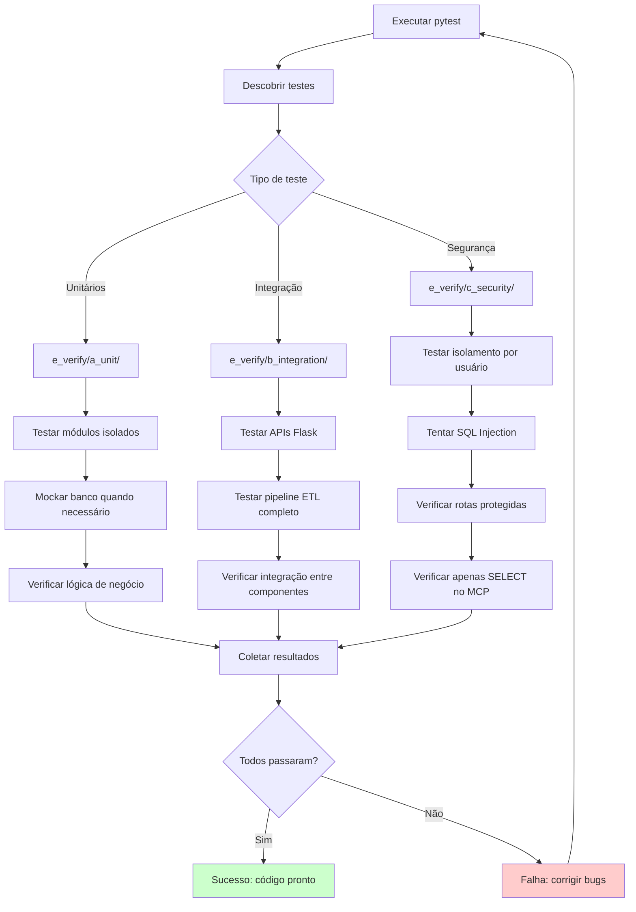

# PRD 18: Testes

## Objetivo

Garantir qualidade do código através de testes automatizados.

## Fluxo da Suíte de Testes

**Explicação:** O diagrama mostra o fluxo de execução da suíte de testes. O pytest descobre os testes e os executa por tipo: unitários (módulos isolados com mocks), integração (APIs Flask e pipeline ETL) e segurança (isolamento, SQL injection, rotas protegidas, MCP readonly). Os resultados são coletados e, se todos passarem, o código está pronto; caso contrário, bugs são corrigidos e os testes são reexecutados.

## Estado Atual

A pasta `tests/` contém os seguintes testes automatizados:

- `test_mcp_readonly.py`: 11 testes do servidor MCP somente leitura (consultas SELECT, escopo por usuário, limites, fórmulas, tools publicadas e allowlist de resources);
- `test_categorias_padrao.py`: inicialização de categorias padrão;
- `test_categorizacao_automatica.py`: categorização automática de transações;
- `test_upload_api.py`: API de upload de CSV;
- `test_user_isolation.py`: isolamento de dados por usuário.

## Tipos de Testes

### Testes Unitários

- Testar funções isoladamente
- Módulos como `src/metrics.py`, `src/categorias.py`, `src/utils.py`
- Mockar banco quando necessário

### Testes de Integração (se aplicável)

- Testar APIs Flask
- Testar pipeline ETL completo

### Testes de Segurança

- Isolamento por usuário: um usuário não vê dados de outro
- SQL Injection: tentar passar SQL malicioso, deve ser tratado como parâmetro
- Autenticação: rotas protegidas retornam 401 sem sessão

## Cobertura

- Testar fluxos principais
- Testar validações
- Testar limites (ex: valores negativos, datas inválidos)

## Critérios de Aceitação

- [x] Pasta `tests/` existe
- [ ] Testes unitários para todos os módulos principais
- [ ] Testes de segurança para isolamento
- [ ] Testes de integração para APIs Flask
- [ ] Testes de interface e integração com MySQL
- [x] Todos os testes existentes passam
